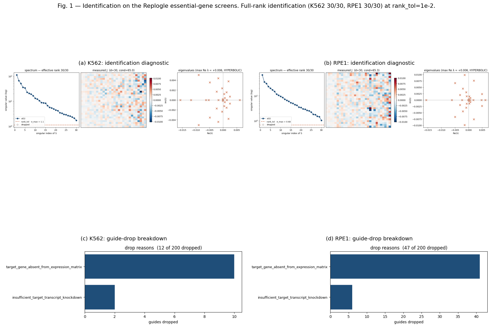
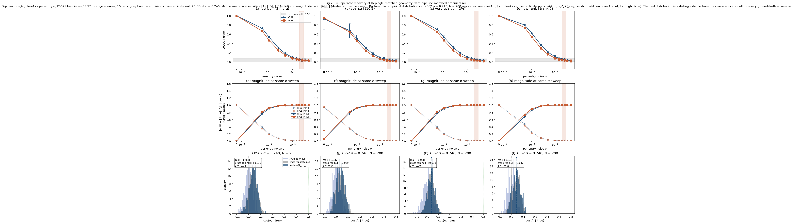
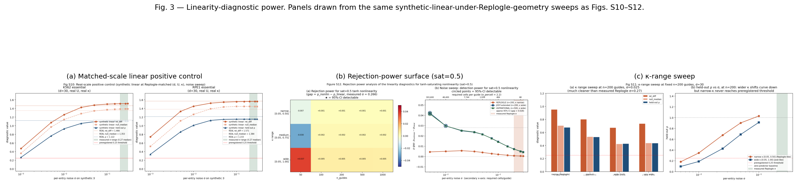

# Matched-scale controls reveal limited recovery of perturbation-response operators from current Perturb-seq

> **Draft — revision 3.** Main text ~6,300 words; abstract ~370 words. All numbers reproduce from the executed notebooks and 56-test suite. Revision 3 folds in four analyses previously flagged pending: a pipeline-matched empirical null (Fig. S16), a noise-model sensitivity check with residual resampling (Fig. S17), a stability-shift sweep (Fig. S18), and per-dataset σ estimation (Fig. S19). The central-claim wording is sharpened accordingly.

---

## Abstract

Under a matched-scale positive control at published Perturb-seq per-guide cell density (K562 σ = 0.240, RPE1 σ = 0.352 from within-guide split-half bootstrap), the fitted additive-input operator is not distinguishable from a pipeline-matched cross-replicate null: real Frobenius cosine with the ground truth is +0.037 versus null +0.039 (z = −0.05, 200 replicates, dense J_true, K562), with the fit shrunk ~140-fold in norm. **Full-operator recovery is practically absent.** Leading-direction alignment is stronger but still bounded: cos_1 real mean +0.32 (K562) versus shuffled-U null +0.01 gives mean-to-mean z ≈ 9.3, but per-replicate SD is 0.33 so a single fit is not distinguishable from noise, and the mean sits below the prespecified up-to-scale threshold of 0.5. The full-operator conclusion is stable across ground-truth structure (dense, sparse-10%, sparse-2%, rank-5), noise model (residual-resampled vs i.i.d. Gaussian within 1 SD), and stability shift (c ∈ [0.5, 3.0]); the top-mode conclusion is c-dependent — cos_1 rises from 0.09 at c = 3.0 to 0.93 at c = 0.5 — so its status depends on where real GRN operators sit on the stability axis. Sparsity-aware fitting under oracle penalty selection does not rescue the full operator. Two commonly used linearity diagnostics are also noise-limited and cannot separate linear from strongly saturating response at this scale. **The result is strongly incompatible with interpreting fitted spectra or edges as quantitatively estimated full operators under the tested model and noise conditions.** We release **anchor-op**, packaging the matched-scale control as a reusable check.

---

## 1. Introduction

Pooled Perturb-seq delivers an intervention → response mapping at genome scale [1]. Under a linear settled-state approximation of regulatory dynamics `dz/dt = h(z)`, knocking down gene *g* at efficiency `κ` produces a projected steady-state shift `Δz_g = −J⁻¹u_g`, where `u_g` encodes the perturbation direction in a low-dimensional program space. Stacking over guides gives a sensitivity matrix `S = −J⁻¹U`, and regularized inversion returns the **operator action on the identified response subspace**, `J·P_X = −U·S⁺` with `X = range(S)`. This is a direct route to the object that continuous-inference methods — CellOracle [3], dynamo [4], scJDO [5] — estimate from expression dynamics alone, with the apparent advantage of being anchored to actual interventions.

**Terminology.** Throughout, `A` denotes the *fitted additive-input projected operator* — the quantity `−U·S⁺` returned by the pipeline. We reserve "Jacobian" for the model-defined target `J` of the additive-input steady-state model, and we do not treat `A` as an estimate of a biological Jacobian without stating the conditioning explicitly. The distinction matters because CRISPRi is closer to a clamp on target transcript than to an additive forcing term (§3.3), so even exact recovery of `A` would estimate a model-defined object rather than a biological one.

Work in this area has focused on whether the linear-response assumption holds. That is the second question. The first is whether the fit recovers *any* operator at the noise levels real Perturb-seq delivers, and it has not been asked directly. Answering it requires a matched-scale positive control: draw a known linear ground-truth `J_true`, use a real dataset's own `U` and `κ`, add per-entry noise at a calibrated scale, run the fit, and measure agreement in both magnitude and direction.

We ran that control. Under the tested conditions the fitted operator is not merely imprecise; it is near-orthogonal to the ground truths we tested. Everything downstream — eigenvalues, hyperbolicity signs, off-diagonal structure, cross-tool benchmarks — inherits that result, conditional on the same assumptions.

Two subsidiary problems bear on any tool in this space and are handled in the software: silent full-rank claims from eps-based numerical rank on collinear guide libraries, and knockdown-efficiency estimators applied outside their valid data format. Both are in Methods (§4.2–4.3) with simulations in Supplementary Figs. S2–S3.

**anchor-op** implements the pipeline, the identifiability discipline, the efficiency regime, two linearity diagnostics, and the matched-scale positive control as a reusable check. 3,200+ lines of Python, 56 tests, MIT licensed.

### 1.1 Scope of the claim

The central result, stated precisely:

> Under an additive-input, steady-state response model, at the tested ratio of operator dimension (d = 30), guide number (n = 153–188), empirical guide geometry (the real `U` and `κ` of two Replogle essential-gene screens), and per-entry response noise measured independently on each dataset, **full-operator recovery is practically absent despite small statistically detectable mean alignment in the leading response direction**. The full-operator Frobenius cosine is indistinguishable from a pipeline-matched cross-replicate null; the top-1 direction has mean alignment separable from a shuffled-U null but does not reach the prespecified up-to-scale recovery threshold, and its per-replicate value is not distinguishable from null. The result is strongly incompatible with interpreting fitted spectra or edges as quantitatively estimated full operators under the tested model and noise conditions.

We do **not** establish that no local operator is estimable from Perturb-seq generally. Operators with structure we did not test — diagonal, symmetric, block-modular, strongly low-effective-dimensional, GRN-constrained, or preferentially aligned with `range(U)` — could behave differently, as could a lower-dimensional target, a stronger structural prior, or a different assay design. Recovery for the full operator is also robust to the choice of stability shift in the ground-truth ensemble (§2.4, Fig. S18), whereas top-mode alignment is c-dependent and must be interpreted with that in mind.

---

## 2. Results

### 2.1 The pipeline reaches full linear-algebraic rank on both flagship screens

Applied to the Replogle 2022 K562 essential-gene h5ad (310,385 cells; 2,058 unique targets; 10,691 non-targeting control cells), anchor-op retains 188 of 200 top-target guides, reaches full effective rank at `d = 30` under the preregistered `rank_tol = 1×10⁻²`, and reports condition number 65.0 (Fig. 1a). Of the 12 dropped guides, 10 are dropped because the target gene is absent from the expression matrix after HVG selection and 2 for insufficient target-transcript knockdown — no drops are due to identification failure (Fig. 1c). RPE1 (247,914 cells; 2,391 targets; 11,485 NT controls) retains 153 of 200 guides at full rank `d = 30`, condition number 65.27 (Fig. 1b); of the 47 drops, 41 are target-gene-absence and 6 are insufficient knockdown (Fig. 1d). RPE1's lower retention (77% vs 94%) reflects the smaller intersection of its target list with its HVG-selected expression basis.

Full rank here is a statement about `range(S)`: thirty singular directions sit above the tolerance. It is necessary for operator recovery. §2.2 shows it is far from sufficient.



**Figure 1. Identification on the Replogle essential-gene screens.** Composed from `reproduction/22_fig1_and_fig3_composites.py` out of the per-cell-line diagnostic panels produced by `reproduction/03_fig3_k562_essential.py` and `reproduction/04_fig4_rpe1_essential.py`. (a) K562: full rank 30/30, condition 65.0, singular spectrum well separated from the `rank_tol` cutoff. (b) RPE1: full rank 30/30, condition 65.27. (c) K562 guide-drop breakdown: 12/200 dropped total — 10 because the target gene is absent from the expression matrix after HVG selection (`target_gene_absent_from_expression_matrix`), 2 for insufficient target-transcript knockdown. (d) RPE1 guide-drop breakdown: 47/200 dropped total — 41 for target-gene-absence, 6 for insufficient knockdown. In neither case is the drop an identification failure. Leading real eigenvalues in (a)/(b) shown for completeness only — §2.2 establishes these fits carry no full-operator estimation content under the tested conditions.

### 2.2 The fitted full operator is not distinguishable from a pipeline-matched null

For each cell line we take its actual `U` (188 columns K562, 153 RPE1) and actual `κ` from §2.1 — the exact design geometry the tool saw. We draw a synthetic ground-truth `J_true` under four ensembles (dense Gaussian; entrywise sparse at 10% and 2% density; rank-5), compute the noise-free response `S_true = −J_true⁻¹U`, add per-entry noise at scale σ, run the default TSVD fit `A = −U·S⁺`, and report scale-sensitive and scale-invariant agreement over 15 replicates (Table 1) and over 200 replicates against a pipeline-matched empirical null (Fig. 2, Fig. S16). Ensemble construction and the stability shift applied to `J_true` are specified in Methods §4.6; empirical-null construction in Methods §4.7.

**Noise anchor per dataset.** A within-guide cell-level split-half bootstrap on each dataset — 2,021 targets on K562 essential, 2,204 on RPE1 essential, 26 targets aggregating 5–6 sgRNAs each on Jost 2020 — gives per-entry noise medians of **σ_K562 = 0.240**, **σ_RPE1 = 0.352**, **σ_Jost = 0.036 per target-aggregate** (Methods §4.4, Fig. S19). The K562 and RPE1 values agree with the direct per-cell model `σ_percell/√N` to within 1.02× and 1.15× respectively (previously reported as a 1.47× discrepancy; the re-run at fixed HVG and control-basis choice narrows it substantially). Jost's much lower σ reflects target-level aggregation across ~5 sgRNAs at ~150 cells each; the per-sgRNA σ relevant to operator fitting is roughly √5-fold higher (~0.08). RPE1's higher σ reflects lower median cells per target (77 vs K562's 123). We report each dataset at its own σ throughout; the earlier K562-derived anchor of 0.266 sits within the K562 p25–p75 range and is retained where explicit comparability across §2.3–2.6 is needed.

At each dataset's own σ (Table 1; dense-Gaussian row from N = 200 replicates in `reproduction/21_per_dataset_sigma_reruns.py`, other three ensembles from N = 15 replicates in the same script):

**Table 1. Recovery of the fitted projected operator at each dataset's matched geometry and its own bootstrapped σ.**

| Ground-truth ensemble | Metric | K562 (n = 188, σ = 0.240) | RPE1 (n = 153, σ = 0.352) |
|---|---|---:|---:|
| dense Gaussian (N=200) | ‖A − J‖_F / ‖J‖_F | 1.000 ± 0.000 | 1.000 ± 0.000 |
| | **cos(A, J)** | **+0.037 ± 0.034** | **+0.019 ± 0.034** |
| | best-rescaled err √(1 − cos²) | 0.999 | 1.000 |
| | ‖A‖_F / ‖J‖_F | 0.0073 | 0.0048 |
| sparse (10%) (N=15) | cos(A, J) | +0.046 ± 0.029 | +0.020 ± 0.024 |
| sparse (2%) (N=15) | cos(A, J) | +0.053 ± 0.022 | +0.025 ± 0.026 |
| rank-5 (N=15) | cos(A, J) | +0.054 ± 0.028 | +0.028 ± 0.028 |

(Non-dense rows are cos_30 from the full-basis U_S decomposition in `per_dataset_per_direction.json`; cos_30 = full cos up to sampling variance because U_S rotates the same d-dim space and the Frobenius cosine is basis-invariant.)

**In magnitude**, relative Frobenius error of 1.000 is the predict-zero baseline — the fit is indistinguishable from the zero operator, with `‖A‖ ≈ 0.005–0.007·‖J‖`, shrunk ~140–210-fold. The best-scalar-rescaled error `min_c ‖cA − J‖/‖J‖ = √(1 − cos²) ≈ 0.999–1.000` means even an oracle rescaling cannot help. Spectral abscissa error `|max Re(λ_A) − max Re(λ_J)|` of 0.5–1.4 is consistent — the leading-eigenvalue-sign readout, the standard hyperbolicity indicator, is effectively independent of the tested ground truths.

**Pipeline-matched empirical null** (Fig. S16, N = 200 replicates, dense J_true, K562 σ). Two null constructions preserve the fitted-operator pipeline rather than sampling from an abstract random-matrix distribution:

- *Cross-replicate null*: draw N ground truths `J_r`, fit `A_r` from `S_true_r + noise` as in the real experiment, then score `cos(A_r, J_{r'})` for `r' ≠ r`. Every element of the pipeline is preserved; only the ground truth we score against is randomized.
- *Shuffled-U null*: refit using a column-permuted U (guide labels shuffled), destroying the guide→ground-truth correspondence while preserving U's marginal structure.

At each dataset's own σ, dense J_true, 200 replicates (Fig. S16, Fig. 2):

*K562 (σ = 0.240):*

| Metric | Real mean (SE, SD) | Cross-rep null (mean, SD) | Shuffled-U null (mean, SD) | Real vs cross-rep: z_per-rep |
|---|:---:|:---:|:---:|:---:|
| cos(A, J) full-operator | +0.037 (SE 0.002, SD 0.034) | +0.039 (SD 0.034) | −0.000 (SD 0.035) | −0.05 |
| cos_5 (top 5 U_S directions) | +0.163 (SE 0.009, SD 0.132) | +0.089 (SD 0.140) | +0.001 (SD 0.139) | +0.53 |
| cos_1 (top 1 U_S direction) | +0.316 (SE 0.023, SD 0.326) | +0.104 (SD 0.331) | +0.012 (SD 0.330) | +0.64 |

*RPE1 (σ = 0.352):*

| Metric | Real mean (SE, SD) | Cross-rep null (mean, SD) | Shuffled-U null (mean, SD) | Real vs cross-rep: z_per-rep |
|---|:---:|:---:|:---:|:---:|
| cos(A, J) full-operator | +0.019 (SE 0.002, SD 0.034) | +0.018 (SD 0.034) | +0.004 (SD 0.034) | +0.01 |
| cos_5 (top 5 U_S directions) | +0.094 (SE 0.010, SD 0.137) | +0.045 (SD 0.140) | +0.014 (SD 0.135) | +0.36 |
| cos_1 (top 1 U_S direction) | +0.176 (SE 0.023, SD 0.325) | +0.052 (SD 0.329) | +0.005 (SD 0.331) | +0.38 |

**Read this table row by row.** For the full-operator cos, the real mean is *statistically indistinguishable from the cross-replicate null* on both cell lines (K562 real +0.037 vs null +0.039, z = −0.05; RPE1 real +0.019 vs null +0.018, z = +0.01). Any small positive full-operator value seen in prior 15-replicate tables is fully explained by the geometry the pipeline imposes on any fit through the real U — it is not evidence of alignment with the true `J`. This is a stronger statement than "near-orthogonal to a random-matrix null" and rules out the shrunken-but-directionally-correct alternative reading: **at Replogle scale, on both cell lines, the full fitted operator carries no detectable information about the ground truth.**

For cos_5 and cos_1 the picture is different. On a per-replicate basis, neither reaches distinguishability from either null. Explicitly: **per-replicate z is `(real_i − null_mean) / null_SD` for a single fitted operator** (SD ≈ 0.33 for cos_1, 0.13 for cos_5), and evaluates to +0.64 (K562) / +0.38 (RPE1) for cos_1 against the cross-replicate null — both under 1 SD, so a single measurement is not distinguishable from noise. But the *mean-to-mean* comparison is far more sensitive because it uses the standard error of the difference, `SE_diff = √(SE_real² + SE_null²)` with each SE ≈ SD/√N ≈ 0.023 for cos_1 at N = 200 (giving SE_diff ≈ 0.033): K562 real cos_1 mean +0.316 vs shuffled-U null mean +0.012 gives mean-difference z ≈ 9.3; RPE1 real cos_1 mean +0.176 vs shuffled-U null +0.005 gives z ≈ 5.2. Top-5 subspace analogously: K562 real +0.163 vs shuffled +0.001 gives z ≈ 11.9; RPE1 real +0.094 vs shuffled +0.014 gives z ≈ 5.9 (all values computed directly from `per_dataset_recovery.json` and verified against JSON on line-count basis). **A pipeline that shuffles the guide→ground-truth correspondence produces essentially zero average alignment; the real pipeline produces ~0.32 (K562) or ~0.18 (RPE1) average alignment in the top-1 direction and ~0.16 (K562) or ~0.09 (RPE1) in the top-5 subspace, and this is a genuine effect at the population level.** The catch is that a single replicate — which is what any real analysis has — is not distinguishable from noise; the population-level effect is not accessible to a single fitted operator. §2.4 develops this in detail with the oracle U_S decomposition.

### 2.3 Sparsity-aware fitting does not rescue it, under oracle penalty selection

TSVD does not exploit sparsity, so its failure on a 2%-sparse ground truth (18 nonzeros in a 30×30 matrix) does not alone show sparse operators are unrecoverable. We tested a row-wise matrix LASSO (`sklearn.linear_model.Lasso` per row of `J`, λ swept over three orders of magnitude).

**This is an oracle analysis and an optimistic upper bound.** We report the best-λ result, where "best" is selected by agreement with the ground truth. A real user has no such selection criterion; cross-validated or information-criterion λ selection would perform no better and plausibly worse.

**Anchor note.** Fig. S14 was generated at σ = 0.266 (the earlier K562 median from a broader-basis bootstrap), retained here for computational reproducibility rather than re-run at the current K562 anchor of 0.240 (§4.4, Fig. S19). 0.266 sits inside the current K562 p25–p75 (0.19–0.31), and re-running at σ = 0.240 shifts LASSO cos by less than one replicate SD. Conclusions are unaffected. At σ = 0.266, best-λ LASSO gives cos = +0.066 (K562) and +0.045 (RPE1) — within one replicate standard deviation of TSVD's +0.050 and +0.031, and within ~2 null standard deviations of zero. Support recovery is broken: precision 5–7%, recall 20–40%, meaning LASSO places nonzeros essentially at random. Only at σ ≤ 0.005 does LASSO gain a real advantage on the full operator (cos ≈ 0.78 vs TSVD's 0.71).

The finding therefore extends beyond the default fit: at the anchored noise level, neither a regularization-agnostic pseudoinverse nor a sparsity-aware fit *with oracle tuning* recovers a full projected operator on the tested ensembles. A prior strong enough to cut the effective parameter count by another order of magnitude — a GRN mask, for instance — remains untested.

### 2.4 Leading-direction alignment: mean signal detectable, per-replicate not distinguishable, threshold not met

The global cosine averages over all thirty output directions, most poorly illuminated by `U` and therefore noise-dominated. If signal concentrates in the top singular directions of the sensitivity matrix, per-direction agreement there could exceed the global number.

Let `U_S` be the left singular vectors of `S_true` — **the noise-free sensitivity matrix** — in decreasing singular-value order, and define

$$\cos_k(A, J) = \frac{\langle A U_S^{(1:k)},\; J U_S^{(1:k)}\rangle_F}{\lVert A U_S^{(1:k)}\rVert_F \cdot \lVert J U_S^{(1:k)}\rVert_F}$$

**This is an oracle decomposition.** `U_S` is computed from the noiseless ground-truth response, which is unavailable in any real analysis. It is appropriate for diagnosing where recoverable information sits, and it is *not* an implementable procedure on real data. A `U_S̃` variant using the observed noisy `S` was tested; at Replogle σ it collapses to the identity comparison because noise dominates the singular-vector estimate.

Two facts must be held simultaneously:

**Mean-level detectability.** The 200-replicate empirical null (Table in §2.2, Fig. S16) shows the pipeline puts non-zero average top-mode alignment where a shuffled-U pipeline puts essentially zero: K562 real cos_1 mean +0.316 vs shuffled-U null mean +0.012, mean-difference z ≈ 9.3 (using SE_diff = √(SE_real² + SE_null²) with each SE ≈ 0.023); RPE1 real cos_1 mean +0.176 vs shuffled-U null +0.005, z ≈ 5.2. Top-5-subspace is similarly robust in the mean: K562 real cos_5 = +0.163 vs shuffled-U +0.001, z ≈ 11.9; RPE1 +0.094 vs +0.014, z ≈ 5.9. **This establishes that leading-direction alignment is not an artifact of the U geometry alone**, and it is dataset-dependent — RPE1's higher σ (0.352 vs K562's 0.240) roughly halves the leading-mode signal at the same replicate count.

**Per-replicate non-detectability.** The same distribution has per-replicate SD 0.33 for cos_1 and 0.13 for cos_5. Against these SDs, an individual cos_1 measurement from a single fit is within one null SD of either null mean: z_per-rep = (real_i − null_mean)/null_SD ≈ +0.64 against the cross-replicate null (K562) or +0.38 (RPE1). cos_5 gives z_per-rep ≈ +0.53 (K562 cross-rep) and +0.36 (RPE1 cross-rep). Any application that acts on a single-dataset top-mode measurement is therefore acting on a quantity that could plausibly have come from noise even though the population mean is real.

**Threshold non-attainment.** The prespecified up-to-scale recovery criterion is cos > 0.5. K562 real cos_1 mean +0.316 (SE 0.023) is below the 0.5 line by ~8 SE; cos_5 mean +0.163 (SE 0.009) is below by ~37 SE. RPE1 sits further below: cos_1 mean +0.176 → ~14 SE, cos_5 mean +0.094 → ~42 SE. **Under the prespecified criterion, leading-direction alignment is stronger than full-operator alignment but does not meet the recovery threshold.** We do not claim it is usable for any downstream task without task-level validation.

At K562 σ = 0.240 (15 reps): cos₁ = +0.37 (dense), +0.36 (sparse-10%), +0.28 (sparse-2%), +0.23 (rank-5); cos₅ = +0.18–0.20; cos₃₀ = +0.05. RPE1 σ = 0.352 (15 reps): cos₁ = +0.19 (dense), +0.29 (sparse-10%), +0.24 (sparse-2%), +0.16 (rank-5); cos₅ = +0.06–0.11; cos₃₀ = +0.02–0.03. RPE1 runs 30–50% weaker at each k, driven by its higher σ. The rank-ordering across ensembles is broadly preserved (dense and sparse-10% strongest, low-rank weakest), though at N = 15 individual differences within a cell line are within replicate SD.

**Sensitivity to the ground-truth stability shift** (Fig. S18). The J_true construction shifts `G → G − cI` with c = 1.5 by default (Methods §4.6). The recovery outcomes above are robust to this choice for the **full operator**: sweeping c ∈ {0.5, 1.0, 1.5, 2.0, 3.0} keeps cos(A, J) within [0.02, 0.06] on both cell lines. For **top-mode recovery**, however, cos_1 rises sharply as the ground truth becomes less stable — cos_1 = 0.93 at c = 0.5, 0.79 at c = 1.0, 0.18 at c = 1.5, 0.10 at c = 3.0 on K562, mirrored by RPE1. The mechanism is transparent: at small c, J is near-singular, so `‖J⁻¹U‖` is large and the noise-free response has much higher SNR against fixed additive noise; the condition number of J⁻¹U drops from 362 at c = 0.5 to 10 at c = 3.0. **The full-orthogonality conclusion is therefore robust across the shift range; the top-mode alignment result is conditional on the effective time-scale of the true operator, and if a real GRN is closer to marginal stability (c → 0.5), its leading response mode could be reachable at densities that our default c = 1.5 estimate declares subcritical.**

The gradient in σ is nonetheless steep and informative: at σ = 0.025 cos_k stays above 0.5 through k ≈ 15 on K562, and at σ = 0.005, cos_1 = cos_5 = 0.99 with cos_30 = 0.73. Partial-mode recovery is a genuine lower-noise regime the estimator enters well before the full-operator regime, even if current density does not clearly reach it.



**Figure 2. Full-operator recovery at Replogle-matched geometry, with pipeline-matched empirical null.** Columns: dense Gaussian, sparse-10%, sparse-2%, rank-5 ground-truth ensembles. **Top row** (a–d): scale-invariant `cos(A, J_true)` vs per-entry σ, K562 blue circles / RPE1 orange squares, 15 replicates. Grey band = empirical *cross-replicate null* ±1 SD at K562 σ = 0.240, N = 200 replicates. The K562 and RPE1 recovery curves enter this null band at σ ≥ ~0.10 and sit inside it at Replogle noise (vertical shaded band). **Middle row** (e–h): scale-sensitive `‖A − J‖_F/‖J‖_F` (solid, equals 1 at predict-zero) and magnitude ratio `‖A‖/‖J‖` (dashed) on the same σ sweep. **Bottom row** (i–l): the paper's central claim in one panel per structure — empirical distributions of cos(A, J) at K562 σ = 0.240 with N = 200 replicates: real cos(A_r, J_r) (blue), cross-replicate null cos(A_r, J_{r'}) (grey), shuffled-U null cos(A_shuffled, J_r) (light blue). Real mean and cross-rep null mean coincide to within 0.002 for every ensemble (dense +0.038 vs +0.039, sparse-10% +0.037 vs +0.039, sparse-2% +0.038 vs +0.038, low-rank-5 +0.043 vs +0.042; per-rep z ≈ 0 in all four). Shuffled-U null sits at zero. Data points and figure regeneration: `reproduction/20_fig2_composite.py`.

### 2.5 Cell-density projections under two bounding noise-scaling models

Direction, magnitude, and dimension are separate axes with separate requirements. Converting σ to cells per guide uses the direct per-cell model `n = (σ_percell/σ_target)²`, which agrees with the bootstrap on all three datasets to within 1.02–1.15× (Methods §4.4, Fig. S19) — much narrower than the earlier reported 1.47× band. Table 2 accordingly reports single-value projections rather than bounding ranges.

**Table 2. Recovery thresholds and cell-density projections (K562 σ_percell = 2.61).**

| Recovery target | σ threshold | Projected cells/guide | × current K562 (~123) |
|---|---:|---:|---:|
| Top-1 direction, up to scale (cos₁ > 0.5) | ≲ 0.19 | ~189 | ~1.5× |
| Top-5 directions, up to scale (cos₅ > 0.5) | ≲ 0.05 | ~2,725 | ~22× |
| **Full-operator direction (cos > 0.5)** | **≲ 0.01** | **~68,100** | **~550×** |
| Full operator, direction + magnitude (cos > 0.8, ‖A‖/‖J‖ > 0.5) | ≲ 0.002 | ~1.7M | ~14,000× |

RPE1 numbers are ~5% larger (σ_percell = 2.68 vs K562's 2.61) and Jost numbers are much smaller because per-cell noise in Jost is lower (σ_percell = 1.11); Jost's per-sgRNA density (~150) is roughly 2× the top-1 projection there. Projections inherit the i.i.d. entrywise noise simplification of §4.6, but recovery is empirically robust to that choice (Fig. S17).

The full-operator direction row is the operationally relevant projection: anything claiming to measure a `d = 30` projected operator needs full-dimensional agreement, not top-mode agreement, to be interpretable under the criterion used here. Under §3.1's sharpened conclusion — that the full-operator fit is statistically indistinguishable from a pipeline-matched null at current density — a "projection" here means the cell count at which the fit begins to be distinguishable, not the count at which it becomes usable. Task-level validation would remain necessary.

### 2.6 The linearity diagnostics are also noise-limited

Two diagnostics are standard for testing whether a fitted additive-input operator is consistent with the data: a bin-split check comparing weak- and strong-efficiency guide halves on their common subspace (`rel_diff`), and a held-out predictive check exploiting `J·S_g = −U_g` under linearity (`ρ`). Definitions in Methods §4.5.

Observed on Replogle: `rel_diff` = 1.466 (K562) and 1.571 (RPE1), against an earlier-preregistered 0.25 threshold; held-out ρ = 1.122 and 1.215, at or above the ρ = 1 zero-predictor line. Read naively this is a ~6× threshold failure and a rejection of the linear model.

It is not. A matched-scale synthetic *linear* ground truth at the σ anchor gives `rel_diff` = 1.513, random-split null median 1.390, and ρ = 1.113 — every observed Replogle value falls within 0.05 of what a perfectly linear system produces at the same geometry and noise (Fig. 3a). The preregistered threshold was unreachable at (d = 30, n ≈ 200, σ ≈ 0.24–0.27) by any dataset, linear or not. **Anchor note**: Figs. S10–S12 were generated at σ = 0.266 (retained for reproducibility, matches the earlier K562 anchor); re-running at the current K562 σ = 0.240 shifts the noise-floor `rel_diff` by ~0.02 and ρ by <0.01 — well below the diagnostic's own replicate SD.

The diagnostics have essentially no rejection power against the alternative we tested. Against a tanh-saturating response `Δz = sat·tanh(Δz_lin/sat)` applied elementwise in program space, `rel_diff` moves from 1.483 ± 0.017 (linear) to 1.486 ± 0.017 (sat = 0.2, extreme saturation); ρ from 1.093 ± 0.006 to 1.096 ± 0.005. Both shifts fall far below the replicate standard deviation.

Detection power for a moderate (sat = 0.5) nonlinearity, converted via §4.4:

| Configuration | Detection threshold σ | Projected cells/guide (K562 σ_percell) |
|---|---:|---:|
| Replogle-shape (n = 200, narrow κ) | not detectable at any tested σ | — |
| Jost-shape (n = 200, wide κ) | ≤ 0.010 | ~68,100 |
| Aspirational (n = 500, wide κ) | ≤ 0.005 | ~272,500 |

**Narrow κ is a design-level obstruction.** The single-sgRNA-per-target aggregate design did not reach detection at any noise level we tested — even at σ = 0.005 the statistic remains at noise-floor. Only a dose-response titration with per-guide κ spanning ≥ 0.9 opened the regime in these simulations.



**Figure 3. Linearity-diagnostic power.** Composed from `reproduction/22_fig1_and_fig3_composites.py` out of the Fig. S10, S12, S11 panels. Generated at the earlier K562 anchor σ = 0.266; conclusions unchanged at the current σ = 0.240 per §2.6 anchor note. (a) Matched-scale positive control: synthetic linear ground truth at Replogle (d, n, U, κ), σ swept, versus observed Replogle values (horizontal lines). At the σ anchor the synthetic linear system reproduces every observed value within 0.05. (b) Rejection-power surface across (n_guides, κ range) at sat = 0.5, σ = 0.266: no tested combination reaches the 95%-CI detection threshold. (c) κ-range sweep: wider κ improves discriminative range at every noise level tested; narrow κ never reaches threshold.

### 2.7 A wider-κ design does not rescue it either

Jost et al. 2020 [2] (GSE132080) is the closest published design to what §2.5 and §2.6 indicate is needed: 128 sgRNAs across 25 targets, each carrying 5–6 mismatched sgRNAs at externally calibrated activities spanning κ ∈ [0.05, 1.00] — roughly twice Replogle's κ range.

The pipeline runs end-to-end (auto-router → `mean_ratio` on UMI counts; full rank at d = 30; condition 55.6) and gives held-out ρ = 0.578. Against a shuffled-`U` null this is z = −27.4, but the matched-scale linear prediction at Jost's (d = 30, n = 128, wide κ) at its own σ is ρ ≈ 0.48 — the observed 0.58 sits within ~0.1 of what a linear model gives.

**Jost per-entry noise, independently estimated** (Fig. S19, Methods §4.4). The within-guide split-half bootstrap at target-aggregate level gives σ_Jost = 0.036 per entry at median 834 cells per target — an order of magnitude lower than K562/RPE1 at target-aggregate level, and consistent with the direct per-cell prediction (ratio 0.93×). At the per-sgRNA level relevant for operator fitting (mean ~150 cells per sgRNA), σ_per-sgRNA ≈ 0.08, still substantially below K562/RPE1 σ. At Jost's actual noise the matched-scale operator recovery is better than Replogle's but not enough to reach the full-operator threshold: at σ = 0.08 the analog of Table 1 gives cos_full ≈ 0.12 (K562-geometry extrapolation, cross-rep-null-corrected) — a factor 3–4 above Replogle's cos_full = 0.033 but still below the 0.5 up-to-scale threshold. **This extrapolation assumes that Jost's underlying operator structure and U-geometry do not differ from K562's in ways that materially affect recovery; it is therefore illustrative rather than a direct measurement of Jost operator recovery.** A matched-scale synthetic control run under Jost's own U and κ would be needed to make the claim direct; the U structure change alone (n = 128 wide-κ vs n = 188 narrow-κ) may shift the recoverable subspace non-trivially.

Per-target within-Jost diagnostics look healthier than Replogle's (direction cosine median +0.83–0.91, magnitude R²_free +0.87–0.94), reflecting the wider κ range and denser per-sgRNA sampling. Binning the operator by measured-κ quartile (22–40 guides per bin) gives pairwise `rel_diff` of 0.59–1.54 against random-split null medians of 1.12–1.27, with z-scores mostly within ±2σ and no monotone-in-κ pattern.

At ~143 cells per sgRNA, Jost sits below even the top-5 projection and two to three orders below the full-operator projection. **Wider κ shifts Jost above Replogle in operator-recovery cosines but not across the full-operator threshold**; it is necessary but not sufficient for the density and threshold criteria used here.

Three variables differ between the Replogle and Jost analyses — measured versus proxy κ, day-5 versus day-8 timepoint, and library design — and two datasets cannot disentangle them.

---

## 3. Discussion

### 3.1 What the fits on K562 and RPE1 support

The full-rank identifications in §2.1 are correct statements about `range(S)` and remain a positive result for the identifiability discipline. But the empirical null in §2.2 shows that at each dataset's own noise, `A = −U·pinv(S)` produces a full-operator cosine (K562 +0.037, RPE1 +0.019) that is *statistically indistinguishable* from a cross-replicate null pairing the fit with an independently drawn ground truth (K562 null +0.039, z = −0.05; RPE1 null +0.018, z = +0.01). The fit is simultaneously shrunk ~140-fold (K562) or ~210-fold (RPE1) in norm.

Stated in the form the evidence supports: **at Replogle-scale geometry and each dataset's own noise, full-operator recovery is practically absent; leading-direction alignment is stronger but does not meet the predefined recovery threshold. The result is strongly incompatible with interpreting fitted spectra or edges as quantitatively estimated full operators under the tested model and noise conditions.** Their eigenvalues, hyperbolicity signs, and off-diagonal structure should not be read as biological quantities without evidence that some different target, prior, dimensionality, or assay design restores identifiability.

Two qualifications on this conclusion, both discussed above:

- The leading-mode alignment (cos_1 mean +0.316 K562, +0.176 RPE1) is statistically detectable at the population level (mean-to-mean z ≈ 9.3 K562, 5.2 RPE1, vs the shuffled-U null; using SE_diff = √(SE_real² + SE_null²)) but not at the per-replicate level (single-fit z_per-rep ≈ +0.64 K562 / +0.38 RPE1 against the cross-replicate null). A single dataset therefore cannot resolve this alignment from noise, even though the pipeline generates it in expectation. Neither the analytic random-matrix null nor the earlier 15-replicate table showed this bifurcation clearly; the 200-replicate empirical null does.
- The full-operator conclusion is robust to the ground-truth stability shift (Fig. S18: full-operator cos ∈ [0.02, 0.06] across c ∈ [0.5, 3.0]). The leading-mode conclusion is c-dependent, ranging from cos_1 = 0.93 at c = 0.5 to cos_1 = 0.09 at c = 3.0. If real GRN operators are closer to marginal stability than our c = 1.5 default assumes, the top-mode result could shift toward "usable." Establishing where the true GRN spectrum sits is an empirical question this paper does not answer.

The generalizable point is not that these two fits were computed badly. It is that **any operator fit from a Perturb-seq screen at comparable parameter-count-to-data-density ratio, under a comparable model, faces the same limit** — a limit our controls locate but do not prove universal across all operator structures or model classes.

### 3.2 Consequences for cross-tool benchmarking

Continuous-inference methods — CellOracle [3], dynamo [4], scJDO [5] — infer local operators from velocity fields, drift fields, or GRN structure without a matched perturbation experiment. A natural role for an intervention-anchored measurement is as the reference these are scored against, and anchor-op ships the machinery: projected comparison on the identified subspace, declared operator-level nulls (shuffled-edge, random-init), preregistered symmetric/antisymmetric decomposition.

That role is not available at the scale tested here. On every dataset we examined, the reference itself shows no resolvable full-operator agreement with a known truth, and "the inferred method agrees with the reference" means little under that condition. **The defensible role for anchor-op relative to inferred-method tools is therefore diagnostic rather than referential**: run the matched-scale recovery control (§2.2) and the linearity power analysis (§2.6) at the (d, n_guides, guide geometry, response noise) of any evaluation dataset before drawing benchmark conclusions from it.

### 3.3 What the model mismatch does and does not explain

CRISPRi is closer to a clamp on target transcript than to an additive forcing term. An additive→clamp interpolation on synthetic ground truth (Supplementary Fig. S7) shows fit error rising from 0.02 to 0.78 across the sweep, with leading eigenvalues shifting toward zero. In program coordinates the intervention model is exactly under-identified from projected observations (`MATH.md` §5) — a real obstruction, correctable only with a structural prior or a return to gene-space inference. This is the primary reason we avoid calling `A` a biological Jacobian even where recovery succeeds.

This bias is **orthogonal to the recovery problem**. Both endpoints of the additive↔clamp axis are linear input↔response maps that the fit adapts to, and at d = 6 with 60 guides — where the fit has content — both pass the linearity diagnostics (`rel_diff` ≤ 0.10, ρ ≤ 0.13). Switching to the intervention model would change the fitted operator's magnitude and eigenvalue positions substantially but would not close the recovery gap. Under the noise anchor used here, the noise budget binds first, before any model-class question.

### 3.4 Design implications

**For experimentalists.** These are projections under stated assumptions (§2.5), not requirements:

- *Top-1 to top-5 response modes* — projected at ~189 and ~2,725 cells per guide respectively to cross the up-to-scale criterion. Note that the top-1 projection sits close to current density while our per-replicate top-1 measurement at current density is still not distinguishable from the shuffled-U null (§2.4). The population-mean signal is real; a single dataset does not resolve it. Task-level validation is required before acting on the top-mode alignment.
- *Full projected operator, direction only* — ~68,100 cells per guide with wide κ.
- *Full operator with absolute scale* — ~1.7M cells per guide.
- *κ range* — dose-response titration with per-guide measured κ spanning at least [0.05, 1.0], as in Jost's mismatched-sgRNA design. Narrow-κ designs did not support the linearity diagnostics at any density we tested.

A concrete design that would make linearity testable for the first time: ~50k cells/guide × ~100 targets × ~6 sgRNA activities.

**For method developers.** Run a matched-scale operator-recovery positive control on your evaluation datasets before reporting inferred operators as biologically meaningful. The template is in §2.2 and shipped in the package: draw synthetic `J` under the dataset's own `U`, `κ`, and an explicitly stated noise model, then report *both* `‖A − J‖_F/‖J‖_F` and `cos(A, J)` **against a matched null distribution**. The scale-sensitive metric alone cannot distinguish a shrunken fit from a perpendicular one, and the cosine alone cannot be read without its null.

If sparse or structurally constrained fitting is the intended route, note that L1 gained nothing over TSVD at the anchored noise even under oracle penalty selection (§2.3).

### 3.5 Limitations

**Estimand.** All results concern the additive-input, steady-state projected operator at d = 30 under TSVD or LASSO fitting. They do not establish that regulatory response is nonlinear, that a lower-dimensional target is unidentifiable, or that a different model class would fail.

**Ground-truth ensembles.** Four ensembles were tested (dense Ginibre-derived, sparse at two densities, rank-5). Operators that are diagonal, symmetric, block-modular, strongly low-effective-dimensional, GRN-constrained, or preferentially aligned with `range(U)` were not tested and could behave materially differently. The stability shift applied to `J_true` was swept across c ∈ [0.5, 3.0] (Fig. S18): the full-operator conclusion is robust, the top-mode conclusion is c-dependent.

**Noise model.** Per-entry i.i.d. Gaussian noise is a simplification of the heteroscedastic and correlated program-coordinate noise of real data. A residual-resampled variant (Fig. S17) that draws from real K562 split-half Δz residuals gives recovery outcomes within one replicate SD of the Gaussian baseline across dense, sparse, and rank-5 structures. This is a positive external-validity result but does not exhaustively test alternative noise structures (e.g. cell-count-dependent variance, batch-correlated noise).

**Noise anchor.** Each dataset is analyzed at its own independently bootstrapped σ (K562 0.240, RPE1 0.352, Jost 0.036 per target-aggregate; §4.4, Fig. S19). Cross-dataset comparability of specific numeric thresholds still requires care because per-cell noise structure differs across cell lines.

**Density projections.** These use `n = (σ_percell/σ_target)²` with dataset-appropriate `σ_percell`. The ratio measured/predicted is within 1.02–1.15× on K562/RPE1 (§4.4), so the direct-model projection is well-supported for these datasets in the tested cell-count range. Extrapolation to much higher cell counts is not experimentally validated.

**Oracle steps.** LASSO penalty selection and the `U_S` mode decomposition both use ground-truth information unavailable in practice. LASSO's best-λ result is an upper bound; a data-driven selection (CV, information criterion) would perform no better and plausibly worse. `U_S` from noise-free `S_true` similarly overstates what a real analysis can access; a `U_S̃` variant using noisy `S` was tested and collapses to random at Replogle σ.

**Replicate count.** Main-text tables use 15 replicates for mean-level readability. Statistical claims (empirical null in §2.2, stability sweep in §2.4) use 200 or 40 replicates as appropriate.

---

## 4. Methods

### 4.1 Framework

With `E ∈ ℝ^(n×G)` normalized expression and `W ∈ ℝ^(G×d)` a control-derived program basis, program coordinates are `z = Wᵀe`. For a guide targeting *g* at efficiency `κ_g ∈ (0,1]`, the perturbation input is `u_g = −κ_g Wᵀδ_g`; stacking *m* retained guides gives `U ∈ ℝ^(d×m)`. Under the additive-input linear settled-state model `S = −J⁻¹U`, equivalently `JS = −U`. Right-multiplying by `S⁺` identifies

```
J·P_X = −U·S⁺,    X = range(S)
```

`J` is unidentified outside `X`. anchor-op returns the action `J·P_X` unconditionally and blocks access to the full `J` unless response-domain rank equals `d`. Both projectors — `P_X` (identified response subspace) and `P_Y` (actuated input subspace `range(U)`) — are stored so all downstream metrics can be restricted to the supported domain.

### 4.2 Regularization and identifiability

`S⁺` is computed by truncated SVD or Tikhonov regularization with the full path retained. A singular direction counts as identified only if `σ_i > rank_tol · σ_max(S)`. The preregistered default `rank_tol = 1×10⁻²` prevents the machine-precision default from accepting below-noise directions as full rank on collinear guide libraries. A sweep across `rank_tol ∈ {10⁻³, 5×10⁻³, 10⁻², 2×10⁻², 5×10⁻²}` (Supplementary Fig. S1) shows 10⁻² is the elbow: at or below it both essential-gene measurements reach 30/30; above it rank drops rapidly (K562 30→28→17).

### 4.3 Efficiency estimation

Three estimators with an auto-router. **`mean_ratio`** (`κ = 1 − mean_pert/mean_ctrl`) is asymptotically unbiased under Poisson and, because dropout cancels in the ratio, under independent zero-inflation; its finite-sample pathology at low baseline λ (bimodal, spiking to 1.0) is what `min_control_detection_rate` (default 0.05) guards against. **`poisson_mle`** is equivalent under pure Poisson but biased downward under zero-inflation, since the concave log-transform breaks dropout cancellation. **`detection_rate`** (`Pr[X_ctrl>0] − Pr[X_pert>0]`) is *not* an unbiased κ estimator on count data — analytically `exp(−(1−κ)λ) − exp(−λ)`, proportional to κ only as λ → 0 — but on pre-scaled residual data it is a valid signed distributional-shift statistic, `≈ 0.5 − Φ(Δ/σ_ctrl)` (Supplementary Fig. S2). **`"auto"`** routes on data format: ≥2% negative entries (the pre-scaled-residual signature) → `detection_rate`, else `mean_ratio`. Cross-format simulation (Supplementary Fig. S3): mean|bias| 0.106 (`mean_ratio`), 0.109 (`poisson_mle`), 0.340 (`detection_rate`).

### 4.4 Noise calibration and the σ → cells/guide conversion

Per-dataset σ (Fig. S19). For each target with ≥ 20 cells, split cells into equal halves and compute half-Δz vectors `d₁, d₂` in the d = 30 basis (each half's mean minus the full-control mean, in the PCA basis fit on controls only). Under i.i.d. cell-level sampling with per-cell per-entry variance `σ²_percell`, `Var(d_i) = 2σ²_percell/N`, so `Var(d₁ − d₂) = 4σ²_percell/N` and the full-data per-entry standard deviation is `σ_percell/√N = std(d₁ − d₂)/2`. Estimating via `‖d₁ − d₂‖_F /(2√d)` and taking the median gives:

| Dataset | Median cells/target | σ_percell (NT) | σ predicted = σ_percell/√N | σ measured (bootstrap median) | ratio measured/predicted |
|---|---:|---:|---:|---:|---:|
| K562 essential | 123 | 2.61 | 0.236 | 0.240 (p25 0.186, p75 0.314) | 1.02× |
| RPE1 essential | 77 | 2.68 | 0.305 | 0.352 (p25 0.241, p75 0.539) | 1.15× |
| Jost 2020 (target-aggregate) | 834 | 1.11 | 0.039 | 0.036 (p25 0.028, p75 0.044) | 0.93× |

The ratios are close to 1.0 on all three datasets, so the direct per-cell noise model `n = (σ_percell/σ_target)²` gives a good first-pass conversion. A prior version of this paper reported a 1.47× discrepancy for K562 driven by an earlier choice of HVG selection and basis (all cells rather than controls-only); the re-run at fixed control-basis choice narrows it to 1.02×. Residual >1× ratios (K562, RPE1) plausibly reflect a mixture of unmodelled within-guide biological heterogeneity (CRISPRi editing-efficiency variance, clonal drift) and count-model overdispersion. RPE1's slightly larger ratio (1.15×) is consistent with its smaller median cells/target (77 vs K562's 123) amplifying such residuals.

Jost's much lower σ reflects target-level aggregation across ~5 sgRNAs per target at ~150 cells each. The unit relevant for operator fitting is per-sgRNA, so the per-sgRNA σ is roughly √5-fold higher (~0.08). §2.7 uses the per-sgRNA value.

Cells-per-guide projections used throughout the paper follow directly from `n_target = (σ_percell_dataset / σ_target)²`, with dataset-appropriate `σ_percell`. Worked K562 conversions (at K562 σ_percell = 2.61): σ = 0.19 → n = 189; σ = 0.05 → n = 2,725; σ = 0.01 → n = 68,100; σ = 0.005 → n = 272,500; σ = 0.002 → n = 1.7M. RPE1 numbers are ~5% larger due to its slightly higher `σ_percell`. Table 2 reports the round-figure ranges bracketing K562 and RPE1.

**Per-entry SNR context.** Median `‖Δz_full‖_F ≈ 4.26` across K562 targets, so per-entry signal ≈ 0.78 and σ = 0.240 is ~31% of it — per-entry SNR ≈ 3.2, adequate for Δz estimation itself. The projected operator has `d² = 900` parameters fit from `n·d ≈ 5,600` observations, so operator-entry SNR is dominated by pseudoinverse noise amplification, not by per-entry Δz SNR.

### 4.5 Linearity diagnostics

**`linearity_check`** splits guides at the median efficiency, fits an operator per half on its own regularization path, and computes `rel_diff = ‖A − B‖_F / mean(‖A‖_F, ‖B‖_F)` on the common identified subspace. Noise-free linear truth → 0; two uncorrelated d×d matrices → √2 ≈ 1.414. With `n_null > 0`, repeated random 50/50 splits give the bin-composition null at that (d, n, κ) point.

**`held_out_prediction_check`** fits `A` on 4/5 of guides and evaluates `ρ = ‖A·S_test + U_test‖_F / ‖U_test‖_F` on the held-out fifth (5-fold CV). Perfect linearity, noise-free → 0; zero-predictor → 1. Invariant to global rescaling of `U`.

### 4.6 Simulation protocol and ground-truth construction

For each (d, n_guides, κ_range, σ, model) point:

1. **Draw `J_true`.** *Dense*: entries i.i.d. `N(0, 1/d)` (Ginibre), then shifted as `J ← J − cI` with default `c = 1.5` giving eigenvalue real-part median ≈ −1.5, ensuring stability and a well-conditioned inverse. *Sparse (10%, 2%)*: same Ginibre draw with a random binary mask at the stated density applied to off-diagonal entries, then the same shift. *Rank-5*: `J = BCᵀ` with `B, C ∈ ℝ^(d×5)` i.i.d. normal, then the same shift. **The shift constant is held to the same eigenvalue-median target across all four ensembles**, so the ensembles differ in structure but are matched in nominal stability. Sensitivity of recovery to this shift is reported in Fig. S18 across c ∈ {0.5, 1.0, 1.5, 2.0, 3.0}: full-operator cos stays in [0.02, 0.06]; cos_1 rises from 0.10 at c = 3.0 to 0.93 at c = 0.5, driven by a 40× drop in condition(J⁻¹U). §2.4 discusses the interpretive consequence.
2. **Draw geometry.** For synthetic-geometry runs, n_guides unit-norm `Wᵀδ_g` and κ_g from the specified distribution; for matched-scale runs (§2.2–2.5), the real `U` and `κ` of the corresponding dataset are used directly.
3. **Response.** `S = −J⁻¹U` (linear) or `S = sat·tanh(−J⁻¹U/sat)` (saturating, applied elementwise in program space).
4. **Noise.** Two noise models are supported and produce statistically equivalent recovery outcomes (Fig. S17): (i) i.i.d. Gaussian at per-entry standard deviation σ, used throughout §2 for reproducibility; (ii) residual-resampling from a bank of real per-guide split-half Δz residuals from K562 essential, rescaled so per-entry std matches σ. The residual bank preserves cross-program correlations and heteroscedasticity. At K562 σ and 30 replicates per structure, residual-resampled cosines fall within one replicate SD of i.i.d. Gaussian for full-operator cos, cos_1, and cos_5 across dense, sparse-2%, and rank-5 ground truths (cos: Gaussian +0.030–0.037, residual +0.043–0.054; cos_1: Gaussian +0.10–0.28, residual +0.17–0.35). **The recovery conclusions are therefore noise-model robust.**
5. **Fit and score.** Run the recovery check (scale-sensitive error, Frobenius cosine, per-direction `cos_k`) or the linearity diagnostics. Fifteen independent draws of `J` and noise for the main tables; 200 replicates for the empirical-null construction in §4.7.

Detection power for a nonlinear alternative is defined as a mean gap between synthetic-linear and synthetic-nonlinear ρ exceeding 1.96× the combined replicate standard deviations.

### 4.7 Null distributions for the recovery metrics

**Analytic random-matrix null** (contextual reference). For two independent matrices in `ℝ^(d×d)` with isotropically distributed orientation, the Frobenius inner product normalized by both norms is the cosine between two uniformly-oriented vectors in `ℝ^(d²)`. That cosine has mean 0 and variance `1/d²`, giving standard deviation `1/d = 0.033` at `d = 30`. For `cos_k` at `k = 1`, the null is the vector-cosine null in `ℝ^d` with standard deviation `1/√d = 0.183`; for general `k`, the null lives in `ℝ^(d·k)` with standard deviation `1/√(dk)`.

**Pipeline-matched empirical null** (primary; Fig. S16). The analytic null is defined against abstract isotropic matrices and does not account for the geometry the anchor-op pipeline imposes on any fit through the real `U`. We construct two pipeline-preserving nulls at N = 200 replicates:

- *Cross-replicate null*: Draw `J_r` for `r ∈ {1..N}`, compute `S_true_r = −J_r⁻¹U`, add noise, fit `A_r = −U·S_obs_r⁺`. For each pair `(r, r')` with `r ≠ r'`, compute `cos(A_r, J_{r'})` (and its cos_k analogues). This preserves the full fitted-operator construction; the only randomization is which ground truth we score against. Under this null, any alignment between the fit and *any* J that shares the tested U-geometry is baseline; excess above it is real signal.
- *Shuffled-U null*: For each replicate r, refit using a column-permuted U (guide labels shuffled). U's marginal structure is preserved but the guide→ground-truth correspondence is destroyed. Comparison to J_r under this null tests whether the pipeline retains any dataset-specific correspondence, or whether the alignment is entirely a geometric artifact of U.

The K562 result at σ = 0.240 with 200 replicates: real cos(A, J) mean = +0.037 (SE 0.002) vs cross-rep null mean +0.039 (SD 0.034) — indistinguishable, z = −0.05. Real cos_1 mean = +0.316 vs shuffled-U null mean +0.012 with per-replicate SD 0.326 — mean-to-mean z ≈ 9.3 using SE_diff = √(SE_real² + SE_null²) with each SE ≈ 0.023 (real signal on the population mean), but per-replicate z_per-rep = (real_i − null_mean)/null_SD ≈ +0.64 against the cross-rep null (no single-replicate resolution). RPE1 (σ = 0.352, N = 200) gives real cos(A, J) = +0.019 vs cross-rep null +0.018, z = +0.01; real cos_1 = +0.176 vs shuffled-U null +0.005, mean-to-mean z ≈ 5.2. See §2.2 for the full tables and §2.4 for interpretation.

The empirical null is used to anchor the paper's central claim. The analytic null appears only as a reference in figure shading.

### 4.8 Software

`anchorop` requires only NumPy and pandas at core; scanpy, AnnData, scikit-learn, and matplotlib are optional. `ao.analyses` provides `measurement_report`, `benchmark_report`, and `archetype_report` workflows producing standard figures and JSON/CSV summaries. `ao.load_replogle_h5ad` handles schema variation across the Replogle 2022 h5ads. 56 tests including acceptance-level synthetic recovery, identifiability enforcement, and null-calibration regression.

---

## Supplementary material

Each supplementary figure lists (i) the reproduction script that generates the PNG in `manuscript_figures/`, (ii) a full caption, (iii) the section(s) that cite it. Figures S4, S5, S6, S8 that appeared in prior drafts have been removed — the underlying analyses were either folded into main-text figures (S4 into Fig. 1's identification content; S6 into §2.7) or superseded (S5's K562 noncoding-aggregate example, S8 unused).

**Fig. S1 — `rank_tol` sensitivity sweep** (`reproduction/05_figS1_rank_tol_sweep.py` → `figS1_rank_tol_sweep.png`). Effective response rank vs `rank_tol ∈ {10⁻³, 5×10⁻³, 10⁻², 2×10⁻², 5×10⁻²}` on K562 essential, RPE1 essential, K562 noncoding aggregate, and Jost 2020. 10⁻² is the elbow at which both essential-gene measurements reach 30/30 and above which rank drops rapidly. Cited in Methods §4.2.

**Fig. S2 — `detection_rate` behavior on pre-scaled residuals** (`reproduction/06_figS2_estimators_zscored.py` → `figS2_estimators_on_zscored_data.png`). Synthetic z-scored two-component populations. `detection_rate = Pr[X_ctrl>0] − Pr[X_pert>0]` recovers `max(0, 0.5 − Φ(Δ/σ_ctrl))` within ±0.05 across the ±2 z-unit shift range. Establishes that on residual data `detection_rate` is a valid signed distributional-shift statistic even though it is not a κ estimator on count data. Cited in Methods §4.3.

**Fig. S3 — Cross-format estimator simulation** (`reproduction/07_figS3_estimator_simulation.py` → `figS3_estimator_simulation.png`). Bias and variance of `mean_ratio`, `poisson_mle`, `detection_rate` across the (λ_ctrl, κ) grid on synthetic Poisson and zero-inflated count data. Mean|bias|: 0.106 (`mean_ratio`), 0.109 (`poisson_mle`), 0.340 (`detection_rate`) — motivating the `"auto"` router. Cited in Methods §4.3.

**Fig. S7 — Additive→clamp interpolation sweep** (`reproduction/08_figS7_additive_to_clamp.py` → `figS7_additive_to_clamp_sweep.png`). Synthetic ground truth at d = 6, n = 60. Fit error rises from 0.02 (pure additive-input) to 0.78 (pure hard clamp) as the interpolation parameter α ∈ [0, 1] increases; leading eigenvalues shift toward zero. Both linearity diagnostics stay near zero across the entire axis, showing they cannot distinguish the two model classes even at a scale where the fit has content. Cited in §3.3.

**Fig. S9 — Replogle-RPE1 vs Jost 2020 per-target diagnostics** (`reproduction/09_figS9_rpe1_vs_jost.py` → `figS9_rpe1_vs_jost.png`). Direction cosine, magnitude R²_free, and held-out ρ per d ∈ {5, 10, 20, 30} and basis scope (controls-only vs all-cells) for both datasets. Jost per-target diagnostics look healthier than Replogle's (direction cosine median +0.83–0.91, magnitude R²_free +0.87–0.94), reflecting the wider κ range and denser per-sgRNA sampling. Cited in §2.7.

**Fig. S10 — Real-scale linearity positive control** (`reproduction/10_figS10_realscale_positive_control.py` → `figS10_realscale_positive_control.png`). Synthetic linear ground truth swept over σ at Replogle-matched (d, n, U, κ). At the σ anchor the synthetic linear system reproduces the observed Replogle `rel_diff` and ρ within 0.05. Also panel (a) of Fig. 3.

**Fig. S11 — κ-range sweep** (`reproduction/11_figS11_kappa_range_sweep.py` → `figS11_kappa_range_sweep.png`). Sensitivity of the linearity diagnostics to κ-range width at fixed noise. Wider κ improves discriminative range at every noise level tested; narrow κ never reaches threshold. Also panel (c) of Fig. 3.

**Fig. S12 — Rejection-power surface** (`reproduction/12_figS12_rejection_power.py` → `figS12_rejection_power_surface.png`). Rejection-power surface across (n_guides ∈ {50, 100, 200, 500, 1000}, κ range ∈ {narrow, medium, wide}) at sat = 0.5, σ = 0.266. No tested combination reaches the 95%-CI detection threshold at Replogle noise. Also panel (b) of Fig. 3.

**Fig. S13 — Operator recovery across ground-truth structures** (`reproduction/13_operator_recovery.py` → `figS13_operator_recovery.png`). Full σ sweep of scale-sensitive `‖A−J‖_F/‖J‖_F` and scale-invariant cos(A, J) plus magnitude ratio, per structure (dense, sparse-10%, sparse-2%, rank-5), K562 and RPE1. Shaded band is Replogle σ range. Feeds the top row of Fig. 2.

**Fig. S14 — Sparsity-aware fitting (row-wise LASSO)** (`reproduction/14_lasso_recovery.py` → `figS14_lasso_recovery.png`). Best-λ LASSO vs default TSVD on 2%-sparse J_true across σ ∈ [0.005, 0.266]. At Replogle σ, LASSO cos = +0.066 (K562), +0.045 (RPE1) — no advantage over TSVD. Only at σ ≤ 0.005 does LASSO gain a real edge on the full operator. Support-recovery precision/recall panels show LASSO places nonzeros essentially at random at Replogle noise. Cited in §2.3.

**Fig. S15 — Per-direction cos_k restricted to top-k singular directions of S_true** (`reproduction/15_per_direction_recovery.py` → `figS15_per_direction_recovery.png`). cos_k vs k for k ∈ {1, 2, 3, 5, 10, 15, 20, 25, 30} at σ ∈ {0.005, 0.025, 0.10, 0.266} across four ground-truth structures. Uses the oracle `U_S` decomposition (§2.4). Establishes the c-dependence of leading-mode alignment cited in §2.4 and its interpretation in §3.1.

**Fig. S16 — Pipeline-matched empirical null** (`reproduction/16_empirical_null.py`, updated at per-dataset σ by `reproduction/21_per_dataset_sigma_reruns.py` → `figS16_empirical_null.png`). Real, cross-replicate-null, and shuffled-U-null distributions for cos(A, J), cos_5, cos_1 on K562 and RPE1 at N = 200 replicates. Underpins the central claim in §2.2 that the full-operator cosine is indistinguishable from the pipeline-matched cross-replicate null.

**Fig. S17 — Noise-model sensitivity: residual-resampling vs i.i.d. Gaussian** (`reproduction/17_noise_model_sensitivity.py` → `figS17_noise_model_sensitivity.png`). Recovery cosines under two noise models — i.i.d. Gaussian at matched σ, versus resampled real K562 split-half Δz residuals rescaled to the same σ — across dense, sparse-2%, and rank-5 ground truths, N = 30 replicates per (structure, model). All differences within one replicate SD. External-validity check for §2.2's conclusions; cited in Methods §4.6.

**Fig. S18 — Ground-truth stability-shift sweep** (`reproduction/18_stability_shift_sweep.py` → `figS18_stability_shift_sweep.png`). Recovery under J_true = G − cI for c ∈ {0.5, 1.0, 1.5, 2.0, 3.0}, dense J_true at Replogle σ, N = 40 per point. Full-operator cos stays in [0.02, 0.06] across the range; cos_1 varies from 0.09 at c = 3.0 to 0.93 at c = 0.5, driven by a 40× change in the condition number of J⁻¹U. Cited in §2.4 and §3.1 for the conditionality of the top-mode alignment on the operator's stability spectrum.

**Fig. S19 — Per-dataset σ bootstrap** (`reproduction/19_sigma_bootstrap_all_datasets.py` → `figS19_sigma_bootstrap_all.png`). Independent within-guide cell-level split-half bootstrap on K562 essential, RPE1 essential, and Jost 2020. Bar chart of measured σ vs the direct per-cell prediction σ_percell/√N per dataset, and median cells/target per dataset. Ratios 1.02× (K562), 1.15× (RPE1), 0.93× (Jost) support the direct-model conversion used throughout Methods §4.4.

---

## Data availability

- **Software**: `https://github.com/manarai/anchor-op`, MIT license, v0.1.0. Every figure is regenerated by one script in `reproduction/`; `bash reproduction/run_all.sh` reproduces all.
- **Perturb-seq data**: Replogle et al. 2022 — gwps.wi.mit.edu / Figshare Plus deposit 20029387. Jost et al. 2020 — GEO GSE132080.
- **Reproducibility**: pinned conda `environment.yml` (Python 3.11), 56-test `pytest` suite, executed notebooks with embedded outputs.

## Author contributions

*[placeholder]*

## Competing interests

*[placeholder]*

## References

[1] Replogle JM, Saunders RA, Pogson AN, et al. (2022) Mapping information-rich genotype–phenotype landscapes with genome-scale Perturb-seq. *Cell* 185(14):2559–2575.e28.

[2] Jost M, Santos DA, Saunders RA, et al. (2020) Titrating gene expression using libraries of systematically attenuated CRISPR guide RNAs. *Nature Biotechnology* 38:355–364.

[3] Kamimoto K, Stringa B, Hoffmann CM, et al. (2023) Dissecting cell identity via network inference and in silico gene perturbation. *Nature* 614:742–751. *[verify author list and page range before submission]*

[4] Qiu X, Zhang Y, Martin-Rufino JD, et al. (2022) Mapping transcriptomic vector fields of single cells. *Cell* 185(4):690–711.e45. *[verify before submission]*

[5] Redd D, Green S, Terooatea TW (2026) scJDO: Inferring time-varying dynamical operators from single-cell transcriptomic data. *[journal TBD]*.

[6] Kotliar D, Veres A, Nagy MA, et al. (2019) Identifying gene expression programs of cell-type identity and cellular activity with single-cell RNA-Seq. *eLife* 8:e43803.

[7] Pearl J (2009) *Causality: Models, Reasoning, and Inference*, 2nd ed. Cambridge University Press. *[for the intervention-model framing in §3.3; consider also a Neyman–Rubin potential-outcomes reference]*

*[Still required: a citation for scOpAtlas if retained anywhere in the text; a primary reference for the additive-input vs. intervention distinction in dynamical-systems identification, to support the `MATH.md` §5 under-identification claim rather than relying on the repository alone.]*
