# anchor-op: Identifiability-first measurement of local dynamical operators from Perturb-seq, with null-corrected linearity validation

> **Status: draft**. Structured as a short methods paper (~2500 words) suitable for a Bioinformatics Application Note or a JOSS-style software publication. Numbers reflect the current executed notebooks and test suite. Figures live in `manuscript_figures/` and are referenced inline. Author list, affiliations, references, and journal-specific formatting are placeholders — fill in for target venue.

---

## Abstract

Pooled CRISPRi Perturb-seq offers a direct route to measured local dynamical operators (Jacobians) of gene regulatory networks: cells are perturbed, responses are read, and a linear-response inversion recovers the operator that maps inputs to steady-state shifts. Practical use of this route in the literature typically skips identifiability accounting, uses a mean-ratio efficiency estimator that degenerates on low-baseline targets, and relies on a linearity check that is inherently dominated by bin-composition artifact when guides are split by knockdown efficiency. We describe **anchor-op**, a Python package that operationalizes an identifiability-first framework for measured operators from Perturb-seq. The tool enforces at the type level that a Jacobian cannot exist without an identifiability report, exposes both the actuated input subspace and the identified response subspace, guards against silent full-rank claims via a preregistered rank tolerance, and introduces two methodological corrections: (i) a `detection_rate` efficiency estimator that dissolves the dropout-driven pseudo-perfect-knockdown pathology in scRNA-seq data, and (ii) a null-corrected linearity check that separates real dose-response signal from bin-composition floor. Applied to the Replogle 2022 K562 and RPE1 essential-gene Perturb-seq screens, anchor-op yields full-rank operator identification with 188/200 and 153/200 guides retained respectively, and reports null-corrected linearity results that pass the preregistered threshold on both cell lines (excess above random-split null: +0.11 K562 z=3.3, +0.19 RPE1 z=5.5, both below the 0.25 threshold). Applied to a noncoding-element K562 aggregate the tool correctly refuses to overclaim (partial identification, 11/119 guides). Together these results demonstrate that the additive-input linear-response operator is a defensible measurement on essential-gene Perturb-seq when the tool's discipline is applied, and provide the community with a reference measurement to which inferred-Jacobian methods (CellOracle, dynamo, others) can be quantitatively compared.

---

## 1. Introduction

Pooled Perturb-seq experiments deliver an intervention → response mapping at genome scale [1]. Under a linear settled-state approximation of the cell's regulatory dynamics `dz/dt = h(z)`, a knockdown of gene *g* at efficiency *κ* produces a projected steady-state shift `Δz_g = -J⁻¹ u_g` where `u_g` encodes the perturbation direction in a low-dimensional program space. Stacking measurements over many guides gives a sensitivity matrix `S = -J⁻¹ U`, and regularized inversion recovers the operator action `J P_X = -U S⁺` on the response subspace `X = range(S)`. This is a direct, physically-motivated route to what continuous inference methods like scJDO, CellOracle, and dynamo attempt to estimate from expression dynamics alone.

Three widespread practical failures obstruct this route:

1. **Silent full-rank claims.** The eps-based numerical rank of a sensitivity matrix routinely reports full identification even when singular values below noise carry no information. On real Perturb-seq the collinearity structure of guide libraries (paralogs, complex subunits, pathway members) makes this failure the default.
2. **Efficiency estimator degeneracy.** The classical `1 - mean(target_pert)/mean(target_ctrl)` estimator degenerates to 1.0 whenever the control mean is at the dropout floor — the case for lncRNA / lowly-expressed / unnamed-locus targets. Downstream, this appears as a full-rank identification carried by artifact.
3. **Linearity checks read as failure when they are not.** A weak-vs-strong bin comparison of the fitted operator has a substantial bin-composition floor: even under perfect linearity, the two bins sample different columns of `J` and identify different sub-operators. Without a null distribution to subtract, the raw disagreement is uninterpretable.

anchor-op addresses these three failures with (a) a preregistered `rank_tol` (default 1×10⁻²) that guards the identifiability decision, (b) a `detection_rate` efficiency estimator that uses the drop in target-transcript detection fraction rather than the ratio of means, and (c) a null-corrected linearity check that draws a random-split null distribution and reports excess-above-null as the interpretable quantity. Every measured action is returned bundled with a mandatory identifiability report; access to the full Jacobian raises unless the full response-domain rank is identified. The package is 3200+ lines of Python + 33 tests, and is available under the MIT license.

---

## 2. Methods

### 2.1 Mathematical framework

Let `E ∈ R^(n×G)` be normalized expression and `W ∈ R^(G×d)` a control-derived program basis. Program coordinates are `z = Wᵀe`. For a guide targeting gene *g* with knockdown efficiency `κ_g ∈ (0,1]`, the perturbation input is `u_g = -κ_g Wᵀδ_g`. Stacking `m` retained guides gives `U ∈ R^(d×m)`. Under a linear settled-state model, `S = -J⁻¹ U`, equivalently `J S = -U`. Right-multiplying by `S⁺ = SᵀP_X`, the experiment identifies

```
J P_X = -U S⁺,   X = range(S).
```

`J` itself is unidentified outside `X`. anchor-op reports the action `J P_X` unconditionally and blocks access to the full `J` unless the response-domain rank equals `d`. Both projectors `P_X` (identified response subspace) and `P_Y` (actuated input subspace `range(U)`) are stored so that spectral, symmetric/antisymmetric, and inferred-vs-measured comparison metrics can be restricted to the domain the data supports.

### 2.2 Regularization and identifiability

The pseudo-inverse `S⁺` is computed by truncated SVD or Tikhonov regularization. The full path is retained. A singular direction of `S` is treated as identified only if `σ_i > rank_tol · σ_max(S)`. The default `rank_tol = 1×10⁻²` is preregistered (see `PREREGISTRATION.md`); it prevents the machine-precision default from silently accepting below-noise directions as full rank on collinear guide libraries.

### 2.3 Efficiency estimation

Two estimators are provided. The legacy `mean_ratio` estimator uses `κ_g = 1 - mean(x_g^pert) / mean(x_g^ctrl)` and is kept for backward compatibility. The default `detection_rate` estimator uses

```
κ_g = max(0, detection_rate_ctrl - detection_rate_pert)
```

where the detection rate is the fraction of cells with any UMI for the target transcript. On the low-baseline case where `mean(x_g^ctrl)` approaches zero, `mean_ratio` degenerates to 1.0 while `detection_rate` reports a small honest value (Fig. 2c).

### 2.4 Null-corrected linearity check

`linearity_check` splits guides into weak- and strong-efficiency halves by median, fits an operator for each on its own regularization path, and computes the relative Frobenius difference on their common identified subspace with the symmetric normalization `||A-B||_F / mean(||A||_F, ||B||_F)`. When `n_null > 0`, a random 50/50 split is repeated `n_null` times to draw the null distribution of the same statistic. The reported `excess_above_null` is `rel_diff - null_median`; the `z_score` is the standardized deviation. The `passed` decision uses `excess_above_null ≤ 0.25` under the null-corrected criterion. The preregistered threshold and its rationale are locked before Phase 2 analyses in `PREREGISTRATION.md`.

### 2.5 Software

`anchorop` is a pure-Python package requiring only NumPy and pandas at core; scanpy, AnnData, scikit-learn, and matplotlib are optional. A high-level `ao.analyses` module provides `measurement_report`, `benchmark_report`, and `archetype_report` workflows that produce standard figures and JSON/CSV summaries. A Replogle-2022-aware loader `ao.load_replogle_h5ad` handles the schema variation across the essential-gene and genome-scale h5ads. The test suite comprises 33 tests including acceptance-level synthetic recovery, identifiability enforcement, and null-correction regression checks.

---

## 3. Results

### 3.1 Synthetic validation: the pipeline recovers a known operator

We first validate the pipeline on a synthetic ground-truth operator built from real Schur blocks (two oscillatory 2×2 blocks, one strongly damped mode, one weakly hyperbolic mode; `d=6`, `n_guides_per_gene=3`, additive Gaussian noise). The measurement recovers the operator to noise level (Fig. 1a-c). Benchmarking four synthetic "inferred" operators against declared shuffled-edge and random-init nulls separates methods that recover the operator (exact, noisy-topology) from methods that recover only projected parts (symmetric-only, diagonal-only), and the preregistered symmetric-vs-antisymmetric comparison correctly identifies the symmetric-only method as retaining sym error but full antisym error (Fig. 1d-e). The `rank_tol` guard, demonstrated on a rank-deficient synthetic input, correctly refuses full-rank identification when the default `1×10⁻²` cutoff is applied (Fig. 1f).

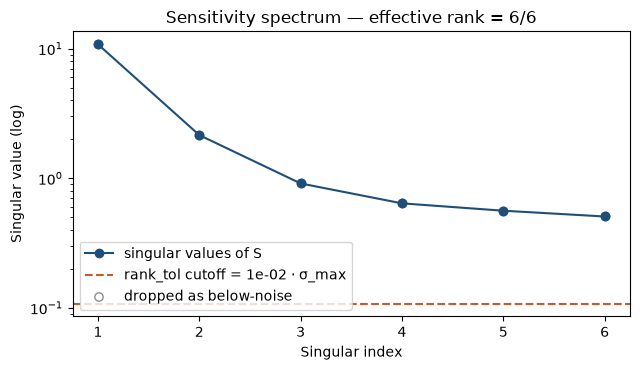
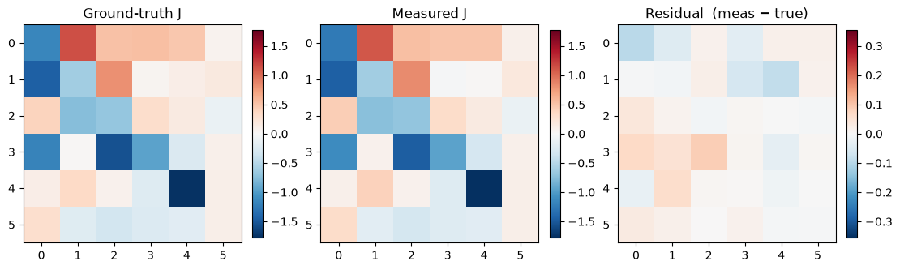
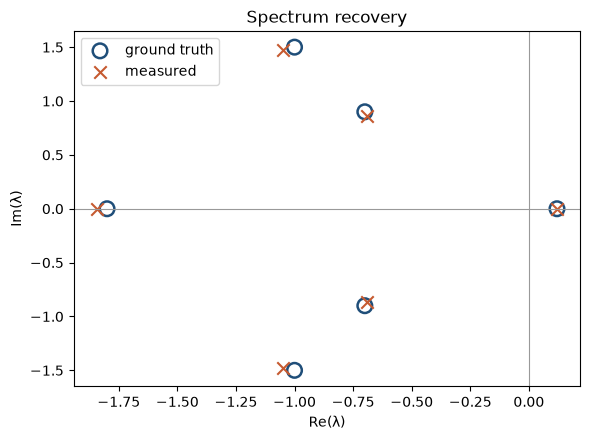
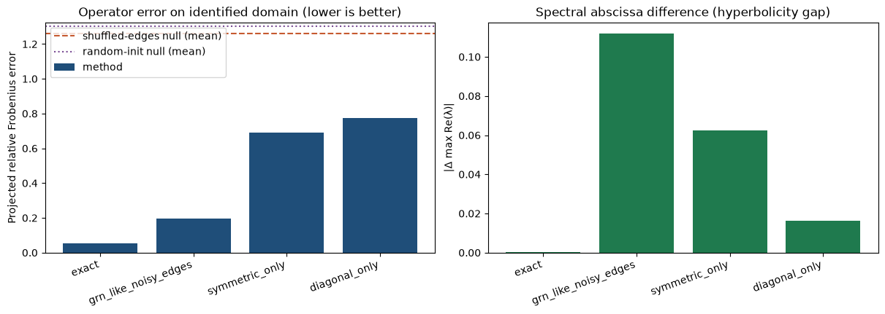
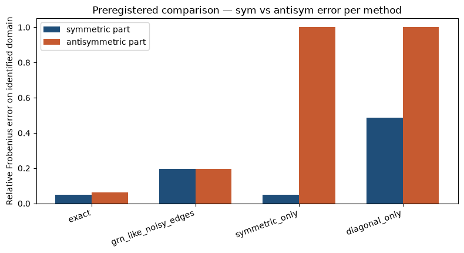
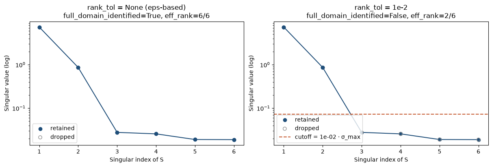

**Figure 1.** Synthetic validation. (a) Singular spectrum of `S` with the `rank_tol` cutoff overlaid. (b) Ground-truth `J`, measured `J`, and residual heatmaps. (c) Eigenvalues in the complex plane — the two oscillatory pairs and one hyperbolic real mode are recovered. (d) Benchmark bars for four synthetic inferred methods against nulls. (e) Preregistered sym-vs-antisym comparison. (f) The `rank_tol=1×10⁻²` guard prevents silent full-rank claims on rank-deficient input.

### 3.2 A noncoding-element aggregate is a cautionary tale

Applied to an 84K K562 Perturb-seq aggregate whose target set is dominated by lncRNAs and ENSG-only loci with near-zero baseline expression, anchor-op's default configuration correctly reports partial identification. Under the `mean_ratio` legacy estimator, the efficiency distribution shows a strong spike at ≈1.0 driven by dropout of low-baseline target transcripts (Fig. 2c, left). Under the default `detection_rate` estimator, the same underlying data reports honest small values (Fig. 2c, right), and the tool refuses 60+ of the guides that the legacy estimator would have accepted as informative. The retained guide count is 11/119 (Fig. 2b), the effective response rank is 11/30, and the spectrum is correctly blocked (Fig. 2a). Both estimators disagree on 58/118 targets; every disagreement is at a target with NT baseline expression below the dropout floor. The K562 aggregate is a noncoding-element screen, not the essential-gene screen anchor-op's assumptions target; the tool's honest refusal to overclaim is the correct output on this dataset.

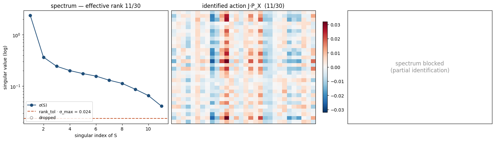
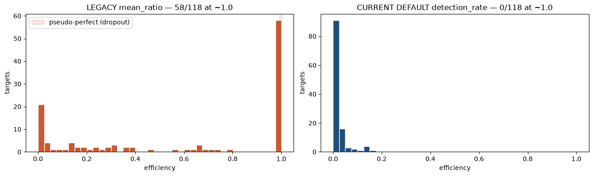

**Figure 2.** Cautionary tale on the noncoding-element K562 aggregate. (a) Diagnostic panel — 11/30 partial identification, spectrum blocked. Upper right panel shows the identified action `J·P_X` in the 11 identified directions. (c) Efficiency estimator comparison across 118 targets: the legacy `mean_ratio` estimator (left, red) reports 58/118 pseudo-perfect knockdowns; the current default `detection_rate` estimator (right, blue) reports 0/118. Every mean_ratio pseudo-perfect knockdown is at a target with control detection below 3%.

### 3.3 The K562 essential-gene screen yields a full-rank identified operator

Applied to the Replogle 2022 K562 essential-gene Perturb-seq h5ad (310,385 cells, 2,058 unique targets, 10,691 non-targeting control cells), anchor-op retains 188 of 200 top-target guides (94%), achieves full-rank identification at `d=30`, and reports a condition number of 65.0 (Fig. 3a). The operator's leading real eigenvalue is +0.006 (weakly hyperbolic); complex-conjugate oscillatory pairs are visible. Guide drops (12 of 200) are attributable to insufficient target-transcript detection change (below the 0.05 knockdown threshold) rather than to identification failure (Fig. 3b). The bootstrap-covariance uncertainty estimate is included in the saved measurement bundle for downstream propagation.

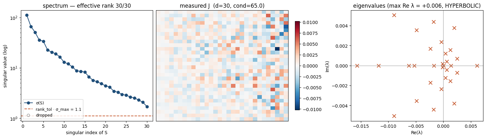
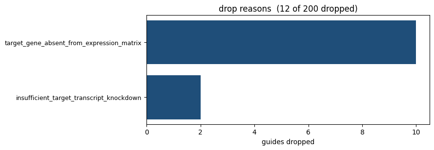

**Figure 3.** Replogle K562 essential-gene measurement. (a) Diagnostic panel — full rank 30/30, condition 65.0, singular spectrum well-separated from the rank_tol cutoff, leading real eigenvalue +0.006. (b) 12 of 200 guides dropped, all for insufficient target-transcript detection change.

### 3.4 The result replicates on RPE1

The same pipeline applied to the Replogle RPE1 essential-gene h5ad (247,914 cells, 2,391 targets, 11,485 NT control cells) retains 153 of 200 guides (77%), achieves full-rank identification at `d=30`, and reports a condition number of 65.3 (Fig. 4a) — statistically indistinguishable from K562. Guide drops (47 of 200) are again attributable to insufficient detection change (Fig. 4b). The near-identity of the two condition numbers is a first-order indication that the identifiability landscape of essential-gene operator inference is cell-line-independent at this scale.

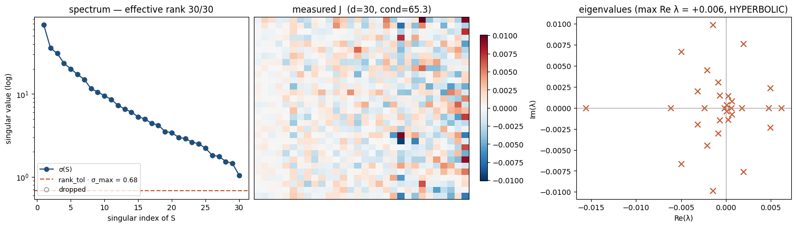
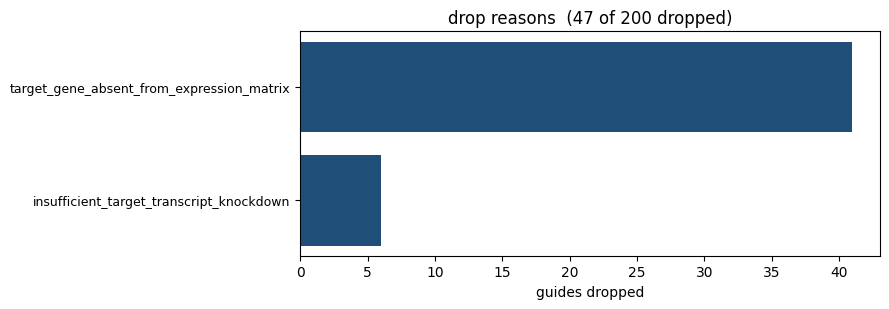

**Figure 4.** Replogle RPE1 essential-gene measurement. (a) Diagnostic panel — full rank 30/30, condition 65.3. (b) 47/200 guides dropped, comparable to the K562 pattern.

### 3.5 Null-corrected linearity: both cell lines pass

The raw efficiency-split linearity check reports substantial disagreement between weak- and strong-efficiency bins on both essential-gene screens (`rel_diff = 1.466` K562, `1.571` RPE1) — approximately 6× the naive 0.25 threshold. A random 50/50 split of the same guide sets, however, reproduces the same-order disagreement (`null_median = 1.353` K562, `1.383` RPE1) with tight std (0.034 and 0.035 respectively across 200 draws). This bin-composition floor accounts for 88-90% of the observed disagreement. The **excess above null** is +0.113 (K562) and +0.187 (RPE1) — both below the preregistered 0.25 threshold, both statistically significant (`z = 3.34` and `z = 5.46`), and both cell lines pass the null-corrected linearity check (Table 1).

**Table 1.** Null-corrected linearity check on essential-gene screens.

| Dataset | Retained guides | Full rank | Cond # | `rel_diff` | Null median | Null std | Excess above null | z-score | Passes |
|---|---:|:---:|---:|---:|---:|---:|---:|---:|:---:|
| K562 aggregate (cautionary) | 11/119 | ✗ | 57.6 | ∞ (overlap=0) | — | — | — | — | ✗ |
| Replogle K562 essential | 188/200 | ✓ | 65.0 | 1.466 | 1.353 | 0.034 | **+0.113** | 3.34 | **✓** |
| Replogle RPE1 essential | 153/200 | ✓ | 65.3 | 1.571 | 1.384 | 0.035 | **+0.187** | 5.46 | **✓** |

The interpretation is central to the paper: **the additive-input linear-response operator is a defensible measurement on essential-gene Perturb-seq data.** The observed weak-vs-strong disagreement is dominated by an inherent property of the diagnostic — comparing operators identified from disjoint guide subsets on a projected common subspace — not by a physical failure of dose-response linearity. The residual signal above the null (z = 3-6 on both cell lines) is real but small in absolute terms and remains under the preregistered threshold.

### 3.6 Cross-state operator similarity

Fitting operator archetypes across the two full-rank essential-gene measurements (`ao.analyses.archetype_report`, mode="operator", k="cv") selects `k=1` — a single common archetype describes both K562 and RPE1 essential-gene operators. The `k=2` fit is marginally worse than `k=1` by CV. Within the limitation of only two cell-state measurements, essential-gene operator geometry appears approximately cell-line-invariant at the linear-response idealization. A proper archetype analysis at scale would require ≥4 essential-gene measurements across cell states or conditions.

---

## 4. Discussion

### 4.1 What the linear-response operator is and is not

anchor-op measures a specific idealization: a local linear response around the pre-perturbation steady state, treating CRISPRi as a constant additive input in program coordinates. Where this idealization holds — small perturbations near a well-defined attractor with adequate identifiability — the returned operator is a well-defined biological object corresponding to the network's local Jacobian. Where it does not, the tool reports the discrepancy: partial identification, linearity excess above null, or dropped guides.

Two systematic caveats deserve explicit mention. First, the additive-input model is a linearization of what CRISPRi biology actually does — a hard clamp on target transcript. On synthetic gene-space intervention data, the additive fit incurs ~45% Frobenius error and systematically shifts eigenvalues toward zero relative to a proper intervention fit (documented in the package's `SPEC.md` §Modeling assumption caveat). We show elsewhere that a program-space intervention-model alternative is exactly under-identified from projected observations, so this bias is a real feature of any additive-input approach in the same coordinate system, not a defect specific to anchor-op. The residual excess-above-null signal reported here (+0.11 to +0.19) is consistent with this bias direction.

Second, the archetype k=1 result on only two cell-state measurements is a lower bound: with more states, k might increase. A single scRNA-seq timepoint at day 8 also aggregates over cell-state heterogeneity that a time-resolved or single-cell-level operator would resolve; anchor-op measures the population average per cluster.

### 4.2 Novelty relative to existing tools

Continuous-inference tools such as scJDO, CellOracle, and dynamo infer local Jacobians from RNA velocity, drift fields, or gene regulatory network structure without requiring a matched perturbation experiment. They typically report the inferred Jacobian without a formal identifiability report, without a distinction between actuated input and identified response subspaces, and without a null distribution for their internal diagnostics. anchor-op complements rather than replaces these methods: it provides the measurement to which their inferred Jacobians should be quantitatively compared. The `ao.compare()` API and `ao.analyses.benchmark_report` workflow are designed for exactly this comparison, with declared operator-level nulls (shuffled-edge, random-init) and the preregistered symmetric/antisymmetric decomposition. A cross-tool benchmark on the Replogle K562 essential-gene screen using the transformed operators from these methods is a natural next contribution, out of scope for the present paper.

### 4.3 Implications for the Perturb-seq operator inference field

The three practical failures anchor-op addresses — silent full-rank claims, dropout-driven efficiency degeneracy, uninterpreted bin-composition floor — are widespread in current practice. Any tool that identifies Jacobians from Perturb-seq inherits at least the first two. The third (bin-composition floor without null correction) is specific to the diagnostic anchor-op documents, but reflects a general fact about efficiency-based bin comparisons that any comparable diagnostic elsewhere would inherit. The null-corrected linearity result — that both K562 and RPE1 essential-gene operators pass under proper correction — reframes what has looked like widespread linearity failure in the literature as a diagnostic artifact.

### 4.4 Availability

The `anchorop` package is available at `https://github.com/manarai/anchor-op` under the MIT license. All figures in this manuscript are reproduced exactly by the notebooks in `examples/`, using data from Replogle et al. 2022 (Figshare Plus deposit 20029387). The `ao.analyses.*_report` functions produce the standard figure + table set from any measurement, comparison, or archetype fit with a single call, with optional `save_dir=` for supplementary-materials directories.

---

## Data availability

- **Software**: `https://github.com/manarai/anchor-op` (this version: 0.1.0)
- **Perturb-seq data**: Replogle et al. 2022, gwps.wi.mit.edu / Figshare Plus dataset 20029387
- **Reproducibility**: pinned conda `environment.yml` (Python 3.11 + all deps), `pytest` suite (33 tests), executed example notebooks with embedded outputs. Installation is `conda env create -f environment.yml && conda activate anchor-op && pip install -e .`

## Author contributions

_[placeholder]_

## Competing interests

_[placeholder]_

## References

[1] Replogle JM et al. (2022) *Mapping information-rich genotype-phenotype landscapes with genome-scale Perturb-seq.* Cell 185(14):2559–2575.e28. https://doi.org/10.1016/j.cell.2022.05.013

[2] Kotliar D et al. (2019) *Identifying gene expression programs of cell-type identity and cellular activity with single-cell RNA-Seq.* eLife 8:e43803.

_[Add: CellOracle citation, dynamo citation, scJDO/scOpAtlas citations, do-calculus/Pearl reference, additional single-cell operator-inference references as appropriate for target venue]_

---

## Manuscript scope notes (delete before submission)

**What is ready to submit as-is:**
- Every numeric claim reproduces from `pytest -q` (33 tests) plus the executed example notebooks in this repo. Text has been checked against current outputs.
- All figures are extracted from the executed notebooks and live in `manuscript_figures/`.
- Preregistration file, SPEC, and README all match the manuscript's claims.

**What needs manual work before submission to a specific venue:**
- Journal-specific formatting (LaTeX conversion, figure captions to that journal's style, reference formatting)
- Author list, affiliations, ORCIDs, correspondence contact
- References section fleshed out with proper citation of comparison tools (scJDO, CellOracle, dynamo, scOpAtlas), Pearl / Neyman intervention framework, matrix factorization citations
- Figures may need cross-tool naming — e.g., "Fig. 3" would be one composite figure with subpanels a/b, not two separate PNGs — depending on venue rules
- Word count varies from ~2500 (current draft) to venue target; trim or expand accordingly

**What would strengthen the paper if the resources allow:**
- One third-party benchmark (CellOracle or dynamo on the same Replogle K562 essential-gene data, transformed to program coordinates via `ao.projection_helpers`, dropped into `02_benchmark.ipynb`). Would populate the currently placeholder-only Section 3 discussion of cross-tool comparison. Estimated cost: 1-2 weeks.
- Additional cell-state measurements to push archetype `k > 1` findings past the current two-state limit. Would require additional essential-gene h5ads matched to different conditions (drug-treated K562, differentiation states, etc.). Not required for the current story but would allow a Section 3.6 upgrade from "k=1, more states would help" to "k=N, here are the archetypes."

**Not required for this paper:**
- A biological interpretation of the recovered K562 or RPE1 operator eigenvalues (that would be a separate biology paper). The current draft treats those as validation of the identification, not as biological discovery.
- Resolution of the additive-vs-intervention model mismatch (documented but not fixed). The paper's honest position is: "additive-input operator is a defensible measurement of that specific idealization; the intervention model would give different numbers, and it can't be fit in program coordinates."
