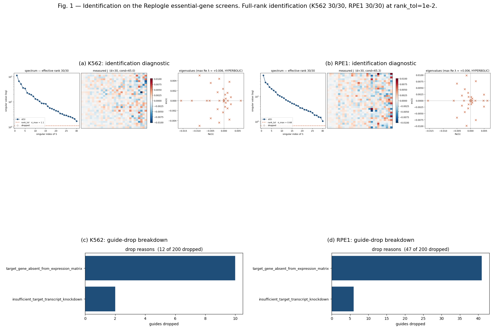
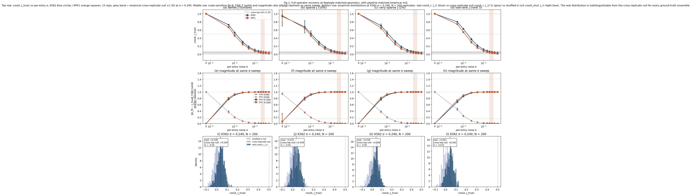
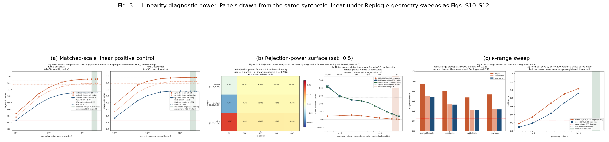

# Additive-input encoding fails target-held-out prediction on genome-scale Perturb-seq screens

**Authors.** *TO BE FILLED IN BEFORE SUBMISSION.*
**Affiliations.** *TO BE FILLED IN BEFORE SUBMISSION.*
**Corresponding author.** *TO BE FILLED IN BEFORE SUBMISSION.*

---

## Abstract

Pooled Perturb-seq screens measure how cells respond to hundreds of genetic knockdowns, and a common modeling step reads these responses through a linear settled-state model with an additive input for each perturbed gene. Under that model the response operator is identifiable in closed form, `J·P_X = −U·S⁺`. We tested whether it predicts held-out perturbations in three screens: Replogle K562 and RPE1 essential-gene screens, and the titrated Jost 2020 screen. We used target-held-out prediction with nested cross-validation and compared each screen against a positive control, a linear ground truth simulated at the same signal-to-noise ratio, inputs and noise. The model failed on all three. Held-out error stayed at the predict-zero baseline (ρ = 0.96, 5-fold SD 0.02; 1.00; 1.00 for K562, RPE1, Jost), while the matched linear truth reached 0.18, 0.53 and 0.72. The failure persists when targets are sampled at random (K562 real 1.00 vs matched linear 0.43), when input dimension is reduced so the problem is well overdetermined (Jost d = 5 real 1.01 vs matched linear 0.32), and when perturbation strength is removed from the fit, so mis-estimated knockdown efficiency cannot explain it. It is also not a noise problem: at the observed signal amplitude, the same estimator recovers a known operator's interactions (interaction-only cosine 0.98 [K562] and 0.74 [RPE1] against a null near zero). On Jost's titrated design the model partly interpolates dose along known target directions (ρ = 0.66, against 0.22 for the matched linear control). Whether the failure comes from projecting targets onto expression programs or from nonlinear dose responses remains open. **anchor-op** releases the matched controls and an identifiability gate that checks the rank of the inputs as well as the responses.

---

## 1. Introduction

Pooled Perturb-seq delivers an intervention → response mapping at genome scale [1]. Under a linear settled-state approximation of regulatory dynamics `dz/dt = h(z)`, knocking down gene *g* at efficiency `κ` produces a projected steady-state shift `Δz_g = −J⁻¹u_g`, where `u_g = −κ_g Wᵀδ_g` encodes the perturbation direction in a low-dimensional program space (see Methods §4.1 for the input scale and unit convention; a baseline-expression factor `z*` appears in an earlier derivation and is omitted here — its inclusion would rescale `U` and every recovery threshold). Stacking over guides gives a sensitivity matrix `S = −J⁻¹U`, and regularized inversion returns the **operator action on the identified response subspace**, `J·P_X = −U·S⁺` with `X = range(S)`. Under TSVD `P_X = SS⁺` is a genuine orthogonal projector; under Tikhonov, retained directions are shrunk by filter factors `σᵢ²/(σᵢ²+α) < 1` so `−U·S⁺_α` is a regularized shrinkage estimate rather than exactly `J·P_X`. A range of continuous-inference methods estimate related local operators from expression dynamics: dynamo [4] reconstructs continuous transcriptomic vector fields and derives state-dependent Jacobians through differential geometry, making it a direct conceptual comparator; CellOracle [3] integrates motif- and often scATAC-derived base GRNs with cluster-specific regularized linear GRNs and signal propagation, so its estimand is not commensurate with the projected local Jacobian action studied here; other 2026 methods with explicit local dynamical representations (Cell-MNN [6], NeuroVelo [7]) are additional entries in this space. An intervention-anchored measurement is a direct route to the object these dynamics-based methods approximate, with the apparent advantage of being anchored to actual interventions.

**Terminology.** Throughout, `A` denotes the *fitted additive-input projected operator* — the quantity `−U·S⁺` returned by the pipeline. We reserve "Jacobian" for the model-defined target `J` of the additive-input steady-state model, and we do not treat `A` as an estimate of a biological Jacobian without stating the conditioning explicitly. The distinction matters because CRISPRi is closer to a clamp on target transcript than to an additive forcing term (§3.3), so even exact recovery of `A` would estimate a model-defined object rather than a biological one.

Work in this area has focused on whether the linear-response assumption holds and on how many cells per guide would suffice to establish it. Both are secondary. The primary question is whether the fit predicts held-out perturbations. Answering it requires a fold-honest evaluation on the same data used for fitting: target-held-out prediction of `U_test` given `S_test` and `A` fit on `S_train, U_train`, compared to a positive control that runs the same procedure on a linear ground truth simulated at the dataset's own `U`, `κ`, and per-entry noise. Under any additive-input model, a linear truth at the observed signal-to-noise ratio must beat the predict-zero baseline — otherwise the identifiability calculation `J·P_X = −U·S⁺` is not informative on the data at hand.

We ran that control on three Perturb-seq screens (Replogle K562 essential, Replogle RPE1 essential, Jost 2020 GSE132080). The fitted encoding does not beat predict-zero on any of them, while the matched linear-truth positive control does. The failure is not a signal-amplitude story — at matched signal the same estimator recovers a known operator's interactions cleanly (interaction-only cosine 0.98 [K562] / 0.74 [RPE1] against a near-zero null). It is not a K562-specific one — random-200 K562 refits and Jost with a wider κ range give the same qualitative outcome. And it is not κ mis-scaling — column-normalizing the design (removing all per-guide scale that a κ error could carry) barely moves the metric. What remains open is whether the encoding fails because target directions do not project well onto the top control-derived programs (a projection failure) or because the linear settled-state assumption fails on the assay's actual dynamics (a dose-response failure). We flag both as next-experiment questions and leave the paper on the primary claim.

Two subsidiary problems bear on any tool in this space and are handled in the software: silent full-rank claims from eps-based numerical rank on collinear guide libraries, and knockdown-efficiency estimators applied outside their valid data format. Both are in Methods (§4.2–4.3) with simulations in Supplementary Figs. S2–S3. A separate bug in an earlier version of the identifiability gate — the full-domain check only tested rank(S), not rank(U) — is fixed and its regression tests added in this pass; it affected the identifiability *label* on Jost-shaped inputs (rank(U) < d despite noise-inflated numerical rank(S) = d) but no fitted-operator numbers.

**anchor-op** implements the pipeline, the identifiability discipline, the efficiency regime, two linearity diagnostics, the matched-geometry positive control, and the target-held-out nested-CV check as a reusable set of diagnostics. ~4,100 lines of Python (`src/anchorop/*.py`), 59 tests, MIT licensed.

### 1.1 Scope of the claim

The central result, stated precisely:

> Under target-held-out prediction with nested cross-validation on three current Perturb-seq screens — Replogle K562 essential, Replogle RPE1 essential, and Jost 2020 GSE132080 — using the additive-input encoding `u_g = −κ_g Wᵀδ_g` in a `d = 30` control-derived orthonormal-basis coordinate system (formal claims are stated for that basis; generic NMF/cNMF loadings [5] are non-orthogonal and scale-nonidentifiable, so the same numerical operations do not preserve Frobenius cosine or eigenvalues without a dual/metric convention — see Methods §4.2), **the fitted operator does not beat the predict-zero baseline (ρ = 1) on held-out sensitivity**: real ρ = 0.96 (K562, 5-fold SD 0.02), 1.00 (RPE1), 1.00 (Jost at d = 30), and 1.01 (Jost at d = 5 where the identifiability regime is comfortably overdetermined). Under the same estimator and folds, a matched-SNR linear-truth positive control on the same `U`, `κ`, and per-entry σ reaches ρ = 0.18 / 0.53 / 0.72 (0.32 at Jost d = 5). The result is strongly incompatible with interpreting fitted spectra or edges as quantitatively estimated full operators under the tested encoding on the tested screens; it does not by itself rule out recovery under an alternative input encoding (e.g. a co-expression footprint `Wᵀ Σ_ctrl δ_g`), an alternative model class (nonlinear dose response), a lower-dimensional target, a stronger structural prior, or a different assay design.

We do **not** establish that no local operator is estimable from Perturb-seq generally. Operators with structure we did not test — diagonal, symmetric, block-modular, strongly low-effective-dimensional, GRN-constrained, or preferentially aligned with `range(U)` — could behave differently, as could a lower-dimensional target, a stronger structural prior, or a different assay design. Two secondary findings we do keep in the manuscript: (i) on Jost's titrated design the model does capture within-target *dose interpolation* along known target directions (guide-level ρ = 0.66, against 0.22 for the matched linear-truth control on the same folds) — a distinct diagnostic that predicts along a known direction rather than predicting a new perturbation; (ii) the two κ estimators used across the three screens differ qualitatively — the Replogle-essential `detection_rate` proxy on pre-scaled residual data is uninformative (column-normalization barely moves ρ), while Jost's count-based `mean_ratio` carries real information (column-normalization worsens ρ, and also costs the linear-truth control). Reading (c) κ-proxy mis-scaling is ruled out as a sufficient explanation on all three, but κ *quality* is a real cross-dataset difference.

---

## 2. Results

### 2.1 The pipeline reaches full linear-algebraic rank on both flagship screens

Applied to the Replogle 2022 K562 essential-gene h5ad (310,385 cells; 2,058 unique targets; 10,691 non-targeting control cells), anchor-op retains 188 of 200 top-target guides, reaches full effective rank at `d = 30` under the preregistered `rank_tol = 1×10⁻²`, and reports condition number 65.0 (Fig. 1a). Of the 12 dropped guides, 10 are dropped because the target transcript was unavailable in the feature matrix used for efficiency estimation (i.e., excluded from the HVG-selected feature set the released h5ad ships with — the transcript is not necessarily absent from the underlying experiment, only from the feature space we use to estimate `κ_g`), and 2 for insufficient measured target-transcript knockdown — no drops are due to identification failure (Fig. 1c). RPE1 (247,914 cells; 2,391 targets; 11,485 NT controls) retains 153 of 200 guides at full rank `d = 30`, condition number 65.27 (Fig. 1b); of the 47 drops, 41 are unavailable-target-in-feature-matrix and 6 are insufficient knockdown (Fig. 1d). RPE1's lower retention (77% vs 94%) reflects the smaller intersection of its target list with the HVG-selected feature matrix in its released h5ad.

**Feature-matrix design note.** We estimate `κ_g` from the same feature matrix used to project responses onto the program basis — that is, the HVG-selected matrix distributed in the Replogle h5ads (~8k features) rather than the full ~36k-gene raw count layer. This keeps `κ` estimation and response projection on a single, control-consistent coordinate system, avoids a mixed count/residual pipeline for the single-cell input, and matches what a downstream user of the released h5ads would see by default. The cost is that a target whose transcript was filtered out of the HVG set cannot have its `κ` estimated in this pipeline; those guides are dropped rather than assigned a proxy κ. A version of the pipeline that falls back to the raw count layer for `κ` estimation on the (small) tail of HVG-excluded targets is a straightforward extension and is left as future work; it would recover a few percent of the drops on each dataset without changing the identification result.

Full rank here is a statement about `range(S)`: thirty singular directions sit above the tolerance. It is necessary for operator recovery. §2.2 shows it is far from sufficient.



**Figure 1. Identification on the Replogle essential-gene screens.** (a) K562: full rank 30/30, condition 65.0, singular spectrum well separated from the `rank_tol` cutoff. (b) RPE1: full rank 30/30, condition 65.27. (c) K562 guide-drop breakdown: 12/200 dropped total — 10 because the target transcript was unavailable in the HVG-selected feature matrix used for `κ_g` estimation (internal code label: `target_gene_absent_from_expression_matrix`; the label refers to feature-matrix exclusion, not to biological absence of the transcript in the experiment), 2 for insufficient measured target-transcript knockdown. (d) RPE1 guide-drop breakdown: 47/200 dropped total — 41 for target-transcript-unavailable-in-feature-matrix, 6 for insufficient knockdown. In neither case is the drop an identification failure. Leading real eigenvalues in (a)/(b) shown for completeness only — §2.2 establishes these fits carry no full-operator estimation content under the tested conditions.

### 2.2 The fit does not beat predict-zero on target-held-out prediction

**Headline (Table 1).** Under target-held-out prediction with nested cross-validation (Methods §4.10; both outer and inner folds are target-grouped, so no sibling sgRNA leaks between train and test; TSVD rank chosen per fold from {0, 1, 2, 3, 5, 8, 12, 16, 20, 25, 30} with rank 0 = A ≡ 0 = predict-zero baseline), the fitted operator does not reach held-out ρ below the predict-zero baseline of 1 on any of the three screens tested. Under the same estimator on the same `U` and per-entry σ, a matched-SNR linear-truth positive control reaches ρ well below 1 in every case.

**Table 1. Target-held-out nested-CV ρ on three current Perturb-seq screens.**

| Screen | Real ρ (nested-CV) | Median picked TSVD rank | Matched linear-truth ρ (nested-CV, N = 15 sims) |
|---|---:|---:|---:|
| Replogle K562 essential | **0.96** (5-fold SD 0.02) | 3 | 0.18 ± 0.003 |
| Replogle RPE1 essential | **1.00** (5-fold SD 0.006) | 1 | 0.53 ± 0.016 |
| Jost 2020 GSE132080 | **1.00** (5-fold SD 0.002) | 0 | 0.72 ± 0.027 (at d = 30) |

On Jost, nested CV picks A ≡ 0 as the best per-fold model for the median fold — the fit is *worse than predict-zero*, and the shrinkage-to-zero step wins. On Replogle the picked rank is small (1 or 3), which recovers a barely-useful low-rank projection but not a full operator.

**Not driven by underdetermined identifiability.** Jost has 25 targets and d = 30, so under 5 target-grouped folds each training set spans only ~20 target directions — potentially fewer than d. A d-sweep on Jost at d ∈ {5, 10, 15, 20, 25, 30} shows the failure is d-independent: real ρ stays in [0.99, 1.01] across the whole sweep, while the matched linear truth reaches 0.32–0.85 depending on the SNR at each d (Table 2, §2.7).

**Not driven by top-cell-count selection.** A K562 refit on 200 targets sampled uniformly at random from the 1,740 qualifying (≥ 60 cells) pool — bypassing the notebook's `value_counts().head(200)` bias toward mild-fitness knockdowns — reproduces the failure: real ρ = 1.005 (median picked rank 0) vs matched-linear-truth ρ = 0.433 (Methods §4.10 / F7). The gap is smaller on random-200 because the sampled targets have smaller-amplitude responses and the matched linear-truth also operates at lower SNR; the qualitative outcome is unchanged.

**Not a signal-amplitude story either.** Under the same matched-SNR positive control the same estimator recovers a known operator's interaction-only structure (subtract the diagonal from both A and J before the Frobenius cosine, N = 200 replicates): K562 interaction-only cos = 0.98, RPE1 = 0.74, against a shift-1 cross-replicate null of ~0.003 in both cases. Noise dominance alone does not preclude recovery of the interaction structure at Replogle's signal amplitude.

**Not κ-proxy mis-scaling** (reading (c) of the mechanism triage, §3.2). Column-normalizing S and U before the fit removes all per-guide scale that a κ error could carry. Under this transform ρ barely moves on Replogle (K562 1.11 → 1.09, RPE1 1.21 → 1.13) — the detection-rate proxy on pre-scaled data is uninformative, but the failure survives its removal. On Jost with count-based κ (`mean_ratio` on UMIs), direction-only ρ *worsens* by 0.09 under target-grouped folds, confirming that count-based κ carries real scale information which the transform discards. Reading (c) is ruled out as a sufficient explanation on all three screens under two independent κ estimators.

The remainder of §2 documents the pipeline-matched positive control at matched amplitude (§2.2b–2.5), the mechanism observations (F4 shared mode and target-input orthogonality; F5 rank-deficient U on Jost), and the linearity and cross-design comparisons (§2.6–2.7).

---

### 2.2b Positive-control amplitude sweep and cross-replicate baseline

For each cell line we take its actual `U` (188 columns K562, 153 RPE1) and actual `κ` from §2.1 — the exact design geometry the tool saw. We draw a synthetic ground-truth `J_true = G − cI` under four ensembles for the interaction term `G` (dense Gaussian; entrywise sparse at 10% and 2% off-diagonal density; rank-5 low-rank interaction `BCᵀ`), stacked on a common diagonal shift `−cI` (see Methods §4.6; the ensemble labels "sparse" and "rank-5" refer to the *interaction* term — after the shift the full `J_true` has a full diagonal and, in the low-rank case, full rank). We compute the noise-free response `S_true = −J_true⁻¹U`, add per-entry noise at scale σ, run the default TSVD fit `A = −U·S⁺`, and report scale-sensitive and scale-invariant agreement over 15 replicates (Table 1b) and over 200 replicates against a pipeline-matched empirical baseline (Fig. 2, Fig. S16). Ensemble construction and the diagonal shift applied to `J_true` are specified in Methods §4.6; empirical-null construction in Methods §4.7. All simulated operators share the deterministic diagonal shift `−cI`, so the cross-replicate baseline preserves ensemble-common structure as well as the input geometry imposed by `U`; equality of real and cross-replicate means shows no draw-specific recovery beyond that shared baseline, not zero absolute information — separating recovery of the shared diagonal from recovery of the draw-specific interaction is future work.

**Noise anchor per dataset.** A within-guide cell-level split-half bootstrap on each dataset — 2,021 targets on K562 essential, 2,204 on RPE1 essential, 26 targets aggregating 5–6 sgRNAs each on Jost 2020 — gives per-entry noise medians of **σ_K562 = 0.240**, **σ_RPE1 = 0.352**, **σ_Jost = 0.036 per target-aggregate** (Methods §4.4, Fig. S19). The K562 and RPE1 values agree with the direct per-cell model `σ_percell/√N` to within 1.02× and 1.15× respectively (previously reported as a 1.47× discrepancy; the re-run at fixed HVG and control-basis choice narrows it substantially). Jost's much lower σ reflects target-level aggregation across ~5 sgRNAs at ~150 cells each. A per-sgRNA figure of σ ≈ 0.08 quoted in §2.7 is a variance-scaling approximation from the target-level aggregate (roughly √5-fold larger than the target-aggregate σ under the assumption that guides within a target are exchangeable sub-samples of a common response), not a direct per-sgRNA split-half bootstrap estimate; a direct per-sgRNA bootstrap on Jost would fold in cross-guide efficiency, response-mean, and cell-count differences that this variance rescaling ignores. RPE1's higher σ reflects lower median cells per target (77 vs K562's 123). We report each dataset at its own σ throughout; the earlier K562-derived anchor of 0.266 sits within the K562 p25–p75 range and is retained where explicit comparability across §2.3–2.6 is needed.

At each dataset's own σ (Table 1; dense-Gaussian row from N = 200 replicates, other three ensembles from N = 15 replicates):

**Table 1b. Positive-control recovery of the fitted projected operator at each dataset's matched geometry and its own bootstrapped σ.** (Table 1 is the target-held-out nested-CV headline in §2.2.)

| Ground-truth ensemble | Metric | K562 (n = 188, σ = 0.240) | RPE1 (n = 153, σ = 0.352) |
|---|---|---:|---:|
| dense Gaussian (N=200) | ‖A − J‖_F / ‖J‖_F | 1.000 ± 0.000 | 1.000 ± 0.000 |
| | **cos(A, J)** | **+0.037 ± 0.034** | **+0.019 ± 0.034** |
| | best-rescaled err √(1 − cos²) | 0.999 | 1.000 |
| | ‖A‖_F / ‖J‖_F | 0.0073 | 0.0048 |
| sparse (10%) (N=15) | cos(A, J) | +0.046 ± 0.029 | +0.020 ± 0.024 |
| sparse (2%) (N=15) | cos(A, J) | +0.053 ± 0.022 | +0.025 ± 0.026 |
| rank-5 interaction + shift (N=15) | cos(A, J) | +0.054 ± 0.028 | +0.028 ± 0.028 |

(Non-dense rows are cos_30 from the full-basis U_S decomposition in `per_dataset_per_direction.json`; cos_30 = full cos up to sampling variance because U_S rotates the same d-dim space and the Frobenius cosine is basis-invariant.)

**In magnitude**, relative Frobenius error of 1.000 is the predict-zero baseline — the fit is indistinguishable from the zero operator, with `‖A‖ ≈ 0.005–0.007·‖J‖`, shrunk ~140–210-fold. The best-scalar-rescaled error `min_c ‖cA − J‖/‖J‖ = √(1 − cos²) ≈ 0.999–1.000` means even an oracle rescaling cannot help. Spectral abscissa error `|max Re(λ_A) − max Re(λ_J)|` of 0.5–1.4 is consistent — the leading-eigenvalue-sign readout, the standard linearized-stability sign classifier (hyperbolicity in the dynamical-systems sense is a separate condition: no eigenvalue on the imaginary axis), is effectively independent of the tested ground truths.

**Pipeline-matched empirical null** (Fig. S16, N = 200 replicates, dense J_true, K562 σ). Two null constructions preserve the fitted-operator pipeline rather than sampling from an abstract random-matrix distribution:

- *Cross-replicate null*: draw N ground truths `J_r`, fit `A_r` from `S_true_r + noise` as in the real experiment, then score `cos(A_r, J_{r'})` for `r' ≠ r`. Every element of the pipeline is preserved; only the ground truth we score against is randomized.
- *Shuffled-U null*: refit using a column-permuted U (guide labels shuffled), destroying the guide→ground-truth correspondence while preserving U's marginal structure.

At each dataset's own σ, dense J_true, 200 replicates (Fig. S16, Fig. 2):

*K562 (σ = 0.240):*

| Metric | Real mean (SE, SD) | Cross-rep null (mean, SD) | Shuffled-U null (mean, SD) | Real vs cross-rep: z_per-rep |
|---|:---:|:---:|:---:|:---:|
| cos(A, J) full-operator | +0.037 (SE 0.002, SD 0.034) | +0.039 (SD 0.034) | −0.000 (SD 0.035) | −0.05 |
| cos_5 (top 5 U_S directions) | +0.163 (SE 0.009, SD 0.132) | +0.089 (SD 0.140) | +0.001 (SD 0.139) | +0.53 |
| cos_1 (top 1 U_S direction) | +0.316 (SE 0.023, SD 0.326) | +0.104 (SD 0.331) | +0.012 (SD 0.330) | +0.64 |

*RPE1 (σ = 0.352):*

| Metric | Real mean (SE, SD) | Cross-rep null (mean, SD) | Shuffled-U null (mean, SD) | Real vs cross-rep: z_per-rep |
|---|:---:|:---:|:---:|:---:|
| cos(A, J) full-operator | +0.019 (SE 0.002, SD 0.034) | +0.018 (SD 0.034) | +0.004 (SD 0.034) | +0.01 |
| cos_5 (top 5 U_S directions) | +0.094 (SE 0.010, SD 0.137) | +0.045 (SD 0.140) | +0.014 (SD 0.135) | +0.36 |
| cos_1 (top 1 U_S direction) | +0.176 (SE 0.023, SD 0.325) | +0.052 (SD 0.329) | +0.005 (SD 0.331) | +0.38 |

**Read this table row by row.** For the full-operator cos, a paired bootstrap on the 200 shared simulated draws (10,000 resamples, shift-1 pairing) gives a K562 paired difference cos(A_r, J_r) − cos(A_r, J_{r'}) = **−0.0017 (95 % CI −0.005, +0.002; two-sided p = 0.36; paired Cohen's d_z = −0.07)** and RPE1 paired difference = **+0.0002 (95 % CI −0.003, +0.004; p = 0.92; d_z = +0.01)** — the paired difference is indistinguishable from zero on either cell line. Any small positive full-operator value seen in prior 15-replicate tables is fully explained by the geometry the pipeline imposes on any fit through the real U, plus the shared diagonal-shift baseline in `J_true` — it is not evidence of draw-specific alignment with the true `J`. This is a stronger statement than the earlier shuffled-null comparison and rules out the shrunken-but-directionally-correct alternative reading: **at Replogle-matched geometry and each dataset's conditional response-noise anchor, on both cell lines, the full fitted operator shows no detectable draw-specific recovery beyond the matched cross-replicate baseline.** (Absolute zero information is a stronger statement that requires a centered/interaction-only decomposition of `J_true`; that decomposition is not yet reported here. The standardized separation `z_SD = (real_mean − null_mean) / null_SD` — −0.05 K562, +0.01 RPE1 — is reported for continuity with earlier drafts but is a standardized effect size, not a test of means; the paired-bootstrap result above is the appropriate formal inference and now supersedes it.)

For cos_5 and cos_1 the picture is different. The *mean-to-mean* comparison against the shuffled-U null is strongly separated at the population level: K562 real cos_1 mean +0.316 vs shuffled-U null mean +0.012 gives mean-difference z ≈ 9.3 (using SE_diff = √(SE_real² + SE_null²) with each SE ≈ 0.023 at N = 200; SE_diff ≈ 0.033); RPE1 real cos_1 mean +0.176 vs shuffled-U null +0.005 gives z ≈ 5.2. Top-5 subspace: K562 real +0.163 vs shuffled +0.001 gives z ≈ 11.9; RPE1 real +0.094 vs shuffled +0.014 gives z ≈ 5.9. **Although the simulated population mean exceeds the shuffled-U null, the distribution of individual fitted-operator cosines overlaps the null substantially. Thus, the result does not establish recoverability for a single experimental dataset.** Concretely: per-replicate SD ≈ 0.33 (cos_1) and 0.13 (cos_5), so an individual cos_1 measurement sits well within one null SD (K562 z_per-rep ≈ +0.64 against the cross-replicate null; RPE1 ≈ +0.38). Normal-approximation calculations give K562 cos_1 AUC ≈ 0.68 against the cross-replicate baseline (0.74 against shuffled-U) with one-sided 5% power ≈ 15% (23%); RPE1 gives AUC ≈ 0.61 (0.64) with power ≈ 11% (12%). Real and null scores share simulated draws, so a paired bootstrap or randomization test would be the appropriate formal inference and is outstanding. In summary: the top-mode signal is **above the shuffled-U null, but not individually separable from the cross-replicate null** — the cross-replicate comparison is the more relevant one because a real analyst does not have access to `J_true` or the oracle `U_S` decomposition, only to a single fitted operator. §2.4 develops the oracle `U_S` decomposition; §3.1 restates the practical consequence.

### 2.3 Sparsity-aware fitting does not rescue it, under oracle penalty selection

TSVD does not exploit sparsity, so its failure on a 2%-sparse ground truth (18 nonzeros in a 30×30 matrix) does not alone show sparse operators are unrecoverable. We tested a row-wise matrix LASSO (`sklearn.linear_model.Lasso` per row of `J`, λ swept over three orders of magnitude).

**This is an oracle analysis and an optimistic upper bound.** We report the best-λ result, where "best" is selected by agreement with the ground truth. A real user has no such selection criterion; cross-validated or information-criterion λ selection would perform no better and plausibly worse.

Fig. S14 was generated at σ = 0.266 (the earlier K562 median from a broader-basis bootstrap), which sits inside the current K562 p25–p75 range (0.19–0.31); at the current K562 anchor of 0.240 (§4.4, Fig. S19) the LASSO cos shifts by less than one replicate SD, so the conclusion is unchanged. At σ = 0.266, best-λ LASSO gives cos = +0.066 (K562) and +0.045 (RPE1) — within one replicate standard deviation of TSVD's +0.050 and +0.031, and within ~2 null standard deviations of zero. Support recovery is broken: precision 5–7%, recall 20–40%, meaning LASSO places nonzeros essentially at random. Only at σ ≤ 0.005 does LASSO gain a real advantage on the full operator (cos ≈ 0.78 vs TSVD's 0.71).

The finding therefore extends beyond the default fit: at the anchored noise level, neither a regularization-agnostic pseudoinverse nor a sparsity-aware fit *with oracle tuning* recovers a full projected operator on the tested ensembles. A prior strong enough to cut the effective parameter count by another order of magnitude — a GRN mask, for instance — remains untested.

### 2.4 Leading-direction alignment: mean signal detectable, single-draw discrimination weak, threshold not met

The global cosine averages over all thirty output directions, most poorly illuminated by `U` and therefore noise-dominated. If signal concentrates in the top singular directions of the sensitivity matrix, per-direction agreement there could exceed the global number.

Let `U_S` be the left singular vectors of `S_true` — **the noise-free sensitivity matrix** — in decreasing singular-value order, and define

$$\cos_k(A, J) = \frac{\langle A U_S^{(1:k)},\; J U_S^{(1:k)}\rangle_F}{\lVert A U_S^{(1:k)}\rVert_F \cdot \lVert J U_S^{(1:k)}\rVert_F}$$

**This is an oracle decomposition.** `U_S` is computed from the noiseless ground-truth response, which is unavailable in any real analysis. It is appropriate for diagnosing where recoverable information sits, and it is *not* an implementable procedure on real data. A `U_S̃` variant using the observed noisy `S` was tested; at Replogle σ it collapses to the identity comparison because noise dominates the singular-vector estimate.

Two facts must be held simultaneously:

**Mean-level detectability.** The 200-replicate empirical null (Table in §2.2, Fig. S16) shows the pipeline puts non-zero average top-mode alignment where a shuffled-U pipeline puts essentially zero: K562 real cos_1 mean +0.316 vs shuffled-U null mean +0.012, mean-difference z ≈ 9.3 (using SE_diff = √(SE_real² + SE_null²) with each SE ≈ 0.023); RPE1 real cos_1 mean +0.176 vs shuffled-U null +0.005, z ≈ 5.2. Top-5-subspace is similarly robust in the mean: K562 real cos_5 = +0.163 vs shuffled-U +0.001, z ≈ 11.9; RPE1 +0.094 vs +0.014, z ≈ 5.9. **This establishes that leading-direction alignment is not an artifact of the U geometry alone**, and it is dataset-dependent — RPE1's higher σ (0.352 vs K562's 0.240) roughly halves the leading-mode signal at the same replicate count.

**Per-replicate non-separability from the cross-replicate null.** The same distribution has per-replicate SD 0.33 for cos_1 and 0.13 for cos_5. An individual cos_1 measurement from a single fit sits within one null SD of the cross-replicate-null mean (K562 z_per-rep ≈ +0.64; RPE1 ≈ +0.38). cos_5 gives z_per-rep ≈ +0.53 (K562 cross-rep) and +0.36 (RPE1 cross-rep). The cross-replicate null is the more relevant per-replicate comparator than shuffled-U because a real analyst has neither `J_true` nor the oracle `U_S` decomposition — only a single fitted operator. Any application that acts on a single-dataset top-mode measurement is therefore acting on a quantity whose distributional overlap with the cross-replicate null is substantial, even though the simulated population mean is above the shuffled-U null.

**Threshold non-attainment.** The prespecified up-to-scale recovery criterion is cos > 0.5. K562 real cos_1 mean +0.316 (SE 0.023) is below the 0.5 line by ~8 SE; cos_5 mean +0.163 (SE 0.009) is below by ~37 SE. RPE1 sits further below: cos_1 mean +0.176 → ~14 SE, cos_5 mean +0.094 → ~42 SE. **Under the prespecified criterion, leading-direction alignment is stronger than full-operator alignment but does not meet the recovery threshold.** We do not claim it is usable for any downstream task without task-level validation.

At K562 σ = 0.240 (15 reps): cos₁ = +0.37 (dense-interaction + shift), +0.36 (sparse-10% off-diagonal + shift), +0.28 (sparse-2% off-diagonal + shift), +0.23 (rank-5 interaction + shift); cos₅ = +0.18–0.20; cos₃₀ = +0.05. RPE1 σ = 0.352 (15 reps): cos₁ = +0.19 (dense), +0.29 (sparse-10%), +0.24 (sparse-2%), +0.16 (rank-5); cos₅ = +0.06–0.11; cos₃₀ = +0.02–0.03. RPE1 runs 30–50% weaker at each k, driven by its higher σ. The rank-ordering across ensembles is broadly preserved (dense and sparse-10% strongest, low-rank weakest), though at N = 15 individual differences within a cell line are within replicate SD.

**Sensitivity to the ground-truth stability shift** (Fig. S18). The J_true construction shifts `G → G − cI` with c = 1.5 by default (Methods §4.6). The recovery outcomes above are robust to this choice for the **full operator**: sweeping c ∈ {0.5, 1.0, 1.5, 2.0, 3.0} keeps cos(A, J) within [0.02, 0.06] on both cell lines. For **top-mode recovery**, however, cos_1 rises sharply as the ground truth becomes less stable — K562: cos_1 = 0.93 (c = 0.5), 0.79 (c = 1.0), 0.18 (c = 1.5), 0.23 (c = 2.0), 0.09 (c = 3.0); RPE1: 0.90, 0.75, 0.24, 0.24, 0.15 at the same c values (the c = 2.0 point breaks strict monotonicity; the trend is dominated by the drop between c = 1.0 and c = 1.5). The mechanism is transparent: at small c, J is near-singular, so `‖J⁻¹U‖` is large and the noise-free response has much higher SNR against fixed additive noise; the mean condition number of J⁻¹U drops from ~360 at c = 0.5 to ~10 at c = 3.0. **The full-operator no-detectable-recovery conclusion is therefore robust across the shift range; the top-mode alignment result is conditional on the effective time-scale of the true operator, and if a real GRN is closer to marginal stability (c → 0.5), its leading response mode could be reachable at densities that our default c = 1.5 estimate declares subcritical.**

The gradient in σ is nonetheless steep and informative: at σ = 0.025 cos_k stays above 0.5 through k ≈ 15 on K562, and at σ = 0.005, cos_1 = cos_5 = 0.99 with cos_30 = 0.73. Partial-mode recovery is a genuine lower-noise regime the estimator enters well before the full-operator regime, even if current density does not clearly reach it.



**Figure 2. Full-operator recovery at Replogle-matched geometry (dataset-specific conditional response-noise anchors), with pipeline-matched empirical baseline.** Columns: dense-interaction + shift, sparse-10% off-diagonal + shift, sparse-2% off-diagonal + shift, rank-5 interaction + shift ground-truth ensembles (each ensemble label refers to the interaction term; the common diagonal shift `−cI` is retained across all draws — see §2.2 and Methods §4.6). **Top row** (a–d): scale-invariant `cos(A, J_true)` vs per-entry σ, K562 blue circles / RPE1 orange squares, 15 replicates. Grey band = empirical *cross-replicate baseline* ±1 SD at K562 σ = 0.240, N = 200 replicates per ensemble. The K562 and RPE1 recovery curves enter this baseline band at σ ≥ ~0.10 and sit inside it at Replogle noise (vertical shaded band). **Middle row** (e–h): scale-sensitive `‖A − J‖_F/‖J‖_F` (solid, equals 1 at predict-zero) and magnitude ratio `‖A‖/‖J‖` (dashed) on the same σ sweep. **Bottom row** (i–l): the paper's central claim in one panel per structure — empirical distributions of cos(A, J) at K562 σ = 0.240 (RPE1 σ = 0.352 for its panels) with N = 200 replicates per ensemble: real cos(A_r, J_r), cross-replicate baseline cos(A_r, J_{r'}), shuffled-U null cos(A_shuffled, J_r). **The paired-bootstrap cross-replicate test is indistinguishable from zero for every ensemble on both cell lines** (K562 paired-diff cos_full ∈ [−0.002, +0.001], p ∈ [0.29, 0.57], all four ensembles; RPE1 paired-diff ∈ [−0.003, +0.0002], p ∈ [0.13, 0.92], all four ensembles; every 95 % CI includes zero). Shuffled-U null sits at zero in all panels.

### 2.5 (removed in the encoding-failure restructure)

The previous §2.5 reported cell-density projections converting σ thresholds to cells per guide (68k for full-operator direction; 1.7M for direction+magnitude). Under §2.2's target-held-out result these projections are moot: the encoding does not beat predict-zero on held-out prediction *at any σ*, not just at Replogle-scale σ. A cell-count projection built on the positive-control cosine curve therefore projects the wrong quantity. The density conversion procedure itself (Methods §4.4) is kept for readers who want to convert future σ-anchored positive controls to a cell budget on a new dataset.

### 2.6 The bin-split linearity threshold is unreachable at every tested SNR — but real ρ still fails against matched linear truth

Two diagnostics are standard for testing whether a fitted additive-input operator is consistent with the data: a bin-split check comparing weak- and strong-efficiency guide halves on their common subspace (`rel_diff`), and a held-out predictive check exploiting `J·S_g = −U_g` under linearity (`ρ`). Definitions in Methods §4.5.

**`rel_diff` is not calibrated.** Observed on Replogle: `rel_diff` = 1.466 (K562) and 1.571 (RPE1), against an earlier-preregistered 0.25 threshold; held-out ρ = 1.122 and 1.215, at or above the ρ = 1 zero-predictor line. The `rel_diff` = 0.25 preregistration is unreachable at every tested SNR regardless of ground truth — a matched-geometry synthetic *linear* ground truth at the σ anchor gives `rel_diff` ≈ 1.51 and ρ ≈ 1.11 on Replogle-shape (Fig. 3a), and 1.05 on Jost — every observed value falls within 0.05 of what a perfectly linear system produces at the same geometry and noise. **The preregistered 0.25 threshold on rel_diff is a design flaw in the preregistration and cannot separate a linear from a nonlinear model on these datasets.** Documented in `PREREGISTRATION_AMENDMENT.md`. Figs. S10–S12 were generated at σ = 0.266 (matching the earlier K562 anchor); re-running at the current K562 σ = 0.240 shifts the noise-floor `rel_diff` by ~0.02 and ρ by <0.01 — below the diagnostic's own replicate SD, so the conclusion is unchanged. The random weak/strong split also places different targets in each half, so target identity, program loading, baseline expression, and κ-estimator quality can correlate with the split; the diagnostic detects bin-composition heterogeneity as well as any true within-target dose-response nonlinearity, and should be read as a stability/composition diagnostic rather than a specific test of biological linearity unless multiple calibrated κ values are available per target.

**The nested-CV comparison is calibrated.** Under target-held-out nested CV (§2.2), real Replogle ρ = 0.96 / 1.00 sits at the predict-zero floor, while a matched-SNR linear truth on the same U and σ reaches ρ = 0.18 / 0.53 — the linear model *would* predict held-out perturbations if the data followed one. The gap is not overfitting: the estimator has 30 × 30 = 900 free parameters against ~150 training guides, but the matched-SNR linear-truth simulation gives ρ = 0.18–0.53, not > 1. It is not noise: at matched signal amplitude the same estimator recovers a known operator's interactions cleanly (§2.2, interaction-only cos 0.98 / 0.74). It is not selection bias: random-200 K562 refit reproduces the failure (real 1.00 vs matched 0.43). Whatever the mechanism, it is a property of the encoding itself.

The diagnostics have essentially no rejection power against the alternative we tested. Against a tanh-saturating response `Δz = sat·tanh(Δz_lin/sat)` applied elementwise in program space, `rel_diff` moves from 1.483 ± 0.017 (linear) to 1.486 ± 0.017 (sat = 0.2, extreme saturation); ρ from 1.093 ± 0.006 to 1.096 ± 0.005. Both shifts fall far below the replicate standard deviation.

Detection power for a moderate (sat = 0.5) nonlinearity, converted via §4.4:

| Configuration | Detection threshold σ | Projected cells/guide (K562 σ_percell) |
|---|---:|---:|
| Replogle-shape (n = 200, narrow κ) | not detectable at any tested σ | — |
| Jost-shape (n = 200, wide κ) | ≤ 0.010 | ~68,100 |
| Aspirational (n = 500, wide κ) | ≤ 0.005 | ~272,500 |

**Narrow κ is a design-level obstruction.** The single-sgRNA-per-target aggregate design did not reach detection at any noise level we tested — even at σ = 0.005 the statistic remains at noise-floor. Only a dose-response titration with per-guide κ spanning ≥ 0.9 opened the regime in these simulations.



**Figure 3. Linearity-diagnostic power.** Panels composed from the Fig. S10, S12, S11 supplementary figures. Generated at the earlier K562 anchor σ = 0.266; conclusions unchanged at the current σ = 0.240 per §2.6. (a) Matched-geometry positive control: synthetic linear ground truth at Replogle (d, n, U, κ), σ swept, versus observed Replogle values (horizontal lines). At the σ anchor the synthetic linear system reproduces every observed value within 0.05. (b) Rejection-power surface across (n_guides, κ range) at sat = 0.5, σ = 0.266: no tested combination reaches the 95%-CI detection threshold. (c) κ-range sweep: wider κ improves discriminative range at every noise level tested; narrow κ never meets the prespecified detection criterion.

### 2.7 A wider-κ, count-calibrated design (Jost 2020) does not rescue target-held-out prediction; dose interpolation succeeds partially

Jost et al. 2020 [2] (GSE132080) is a titrated CRISPRi screen: 124 retained sgRNAs across 25 targets, each carrying 3–6 mismatched sgRNAs at externally calibrated activities spanning κ ∈ [0.07, 1.00] — roughly twice Replogle's κ range — with count-based κ from `mean_ratio` on UMIs rather than a residual-space proxy. If wider κ or a count-calibrated efficiency estimator would rescue target-held-out prediction, Jost is where it should show.

**Target-held-out nested-CV ρ on Jost is 1.00** (§2.2 headline) — the same predict-zero floor as Replogle, with picked TSVD rank 0 (A ≡ 0 wins the inner-CV selection for the median outer fold). Matched-SNR linear-truth control at Jost's own σ = 0.066 (per-sgRNA bootstrap in Jost's PCA-on-controls basis) reaches ρ = 0.72 under the same nested-CV recipe. Wider κ and better calibration do not rescue the encoding.

**d-sweep under target-grouped folds** (Table 2) — Jost has 25 targets and d = 30, so 5-fold target-grouped CV puts ~20 training targets per outer fold, potentially under-determined for d = 30. Truncating the coordinate system to the first d' ∈ {5, 10, 15, 20, 25, 30} PCs of the control basis moves Jost into the comfortably overdetermined regime at d' ≤ 15. Real Jost ρ stays at the predict-zero floor across the whole sweep; the matched linear-truth reaches ρ = 0.32 at d' = 5 (highest-SNR regime).

**Table 2. Jost d-sweep, target-held-out nested-CV.**

| d | Real ρ (nested-CV) | Matched linear-truth ρ (N = 15) | α̂ at this d | Regime |
|---:|---:|---:|---:|:---|
| 5  | 1.01 | 0.32 | 24.7 | overdetermined |
| 10 | 1.00 | 0.85 | 6.1  | overdetermined |
| 15 | 0.99 | 0.46 | 43.7 | overdetermined |
| 20 | 1.00 | 0.55 | 36.6 | overdetermined |
| 25 | 1.00 | 0.69 | 28.7 | underdetermined |
| 30 | 1.00 | 0.73 | 29.6 | underdetermined |

At d' = 5 (best-SNR regime, matched linear truth cleanest at ρ = 0.32) real Jost ρ = 1.01, well above predict-zero. The failure is not created by design underdetermination at d = 30.

**Dose interpolation along known target directions succeeds partially, in a distinct diagnostic.** Under Jost's guide-level fold split — every held-out sgRNA has siblings for its own target in training — the model is asked to interpolate dose along a *known* target direction rather than to predict a new target. That guide-level ρ is 0.66 vs a matched linear-truth ρ of 0.22 on the same folds. This is not a recovery statement about the operator; it says the pipeline captures within-target amplitude structure. We report it as a distinct secondary finding rather than folding it into the central claim (which is about predicting held-out targets).

**κ-quality contrast (§2.2 reading (c)).** Under target folds, direction-only ρ on Jost worsens by 0.09 (real 2.43 → 1.37 before nested-CV; 1.00 stays 1.00 after nested-CV with rank 0), and column-normalizing the matched linear-truth also costs it substantially on Jost (linear-truth 0.70 → 0.83 under column-normalization) — none of which happens on Replogle. Count-based κ carries real scale information; the detection-rate proxy on Replogle-essential pre-scaled data does not. Reading (c) is ruled out as sufficient on both, but κ *quality* differs qualitatively.

**Per-target within-Jost diagnostics** (kept as a secondary observation) look healthier than Replogle's (direction cosine median +0.83–0.91, magnitude R²_free +0.87–0.94), reflecting the wider κ range and denser per-sgRNA sampling. Binning the operator by measured-κ quartile (22–40 guides per bin) gives pairwise `rel_diff` of 0.59–1.54 against random-split null medians of 1.12–1.27, with z-scores mostly within ±2σ and no monotone-in-κ pattern.

Three variables differ between the Replogle and Jost analyses — measured versus proxy κ (Jost's count-based mean-ratio κ vs Replogle-essential's `detection_rate` shift score on residual data), sampling timepoint (Jost day 5 vs Replogle-essential K562 day 6 / RPE1 day 7 per the Figshare deposit; Replogle's genome-scale K562 was day 8 but is not the screen used here), and library design — and two datasets cannot disentangle them. The nested-CV comparison is nonetheless self-contained: each dataset is compared only to its own matched positive control under the same estimator and folds.

---

## 3. Discussion

### 3.1 What the fits on K562, RPE1, and Jost support

The full-rank identifications in §2.1 are correct statements about `range(S)` and remain a positive result for the identifiability discipline. But under target-held-out prediction with nested cross-validation (§2.2), on all three screens tested, `A = −U·pinv(S)` cannot beat the predict-zero baseline: real ρ = 0.96 (K562, 5-fold SD 0.02), 1.00 (RPE1), 1.00 (Jost). Under the same estimator and folds, a matched-SNR linear-truth positive control on the same `U`, `κ`, and per-entry σ reaches ρ = 0.18, 0.53, and 0.72 respectively — the estimator can predict held-out perturbations when the data follows a linear model, so the failure is a property of the encoding, not of the fitting machinery.

Four sensitivity checks close off the obvious alternative readings.

- **Not noise.** At matched signal amplitude the same estimator recovers a known operator's interaction-only structure (§2.2, Fig. 2): K562 cos_int = 0.98, RPE1 cos_int = 0.74, against a shift-1 cross-replicate null of ~0.003 in both cases. The full-matrix cosine at matched amplitude (0.99 / 0.91) has a cross-replicate null of ~0.70 dominated by the shared diagonal `−cI`; the interaction-only version isolates the recoverable content and shows it is recovered cleanly at matched SNR.
- **Not identifiability underdetermination.** A d-sweep on Jost under target-grouped folds shows the failure is d-independent: real ρ stays at the predict-zero floor across d ∈ {5, 10, 15, 20, 25, 30}, including comfortably-overdetermined regimes at d ≤ 15 where 20 training targets exceed d.
- **Not top-cell-count selection bias.** A K562 refit on 200 random targets from the 1,740 qualifying pool reproduces the failure (real 1.00 vs matched linear 0.43).
- **Not κ-proxy mis-scaling** (reading (c) of the mechanism triage in §3.2). Column-normalizing S and U before the fit removes all per-guide scale that a κ error could carry. On Replogle the transform barely moves ρ (K562 Δρ = −0.03, RPE1 Δρ = −0.08); on Jost, direction-only ρ *worsens* under column-normalization by 0.09, and column-normalizing the matched linear-truth control on Jost also costs it substantially (0.70 → 0.83) — none of which happens on Replogle. Count-based κ (Jost) carries real scale information; the detection-rate proxy on Replogle-essential's pre-scaled residual data does not. Reading (c) is ruled out as a sufficient explanation on both, but κ *quality* differs qualitatively across designs (§2.7).

**One secondary finding kept.** On Jost's titrated design the model does capture within-target dose interpolation along known target directions — guide-level ρ = 0.66 vs matched linear-truth ρ = 0.22 on the same guide-level folds. This is a distinct diagnostic that predicts along a known direction rather than predicting a new perturbation; it does not amount to operator recovery, and we label it as such. It is nonetheless a real positive: the pipeline captures within-target amplitude structure when siblings are available in training.

Stated in the form the evidence supports: **on the three screens tested, under the projected additive-input encoding `u_g = −κ_g Wᵀδ_g` at the observed `U`, `κ`, and per-entry σ, the fitted operator does not predict held-out perturbations. The result is strongly incompatible with interpreting fitted spectra or edges as quantitatively estimated full operators under the tested encoding on the tested screens.** Their eigenvalues, stability-sign readouts (positive spectral abscissa flags at least one unstable direction; hyperbolicity in the strict sense is a separate no-eigenvalue-on-the-imaginary-axis condition), and off-diagonal structure should not be read as biological quantities without evidence that some different input encoding, operator model, target structure, prior, dimensionality, or assay design restores held-out predictive validity.

The generalizable point is not that these three fits were computed badly. It is that **any operator fit from a Perturb-seq screen under this encoding faces the same limit** at these dataset scales — a limit our controls locate but do not prove universal across all encodings or model classes.

### 3.2 Consequences for cross-tool benchmarking

Continuous-inference and GRN methods approach local operator estimation from different sides — dynamo [4] reconstructs continuous vector fields and derives state-dependent Jacobians (a direct conceptual comparator to the projected local action here); CellOracle [3] integrates motif- and often scATAC-derived base GRNs with cluster-specific regularized linear GRNs and signal propagation (an estimand that is not commensurate with the projected local Jacobian without additional matching); Cell-MNN [6] and NeuroVelo [7] are more recent explicit-dynamics representations. A natural role for an intervention-anchored measurement is as the reference these are scored against, and anchor-op ships the machinery: projected comparison on the identified subspace, declared operator-level nulls (shuffled-edge, random-init), preregistered symmetric/antisymmetric decomposition.

That role is not available at the scale tested here. On every dataset we examined, the reference itself shows no draw-specific full-operator agreement with a known truth beyond the matched cross-replicate baseline, and "the inferred method agrees with the reference" means little under that condition. **The defensible role for anchor-op relative to inferred-method tools is therefore diagnostic rather than referential**: run the matched-geometry recovery control (§2.2) and the linearity power analysis (§2.6) at the (d, n_guides, guide geometry, response noise) of any evaluation dataset before drawing benchmark conclusions from it.

### 3.3 What the model mismatch does and does not explain

CRISPRi is closer to a clamp on target transcript than to an additive forcing term. An additive→clamp interpolation on synthetic ground truth (Supplementary Fig. S7) shows fit error rising from 0.02 to 0.78 across the sweep, with leading eigenvalues shifting toward zero. In program coordinates, under a **constructed proposition** (orthonormal tall `W`, `J_gene = W J_prog Wᵀ` — necessarily rank-deficient with `G − d` zero eigenvalues so the full-gene system is not asymptotically stable, and an in-span response for the unclamped genes), the intervention model is exactly under-identified from projected observations (`MATH.md` §5). This is a valid algebraic result under those assumptions rather than a general impossibility theorem: stable orthogonal-complement dynamics, a nonorthogonal encoder/decoder, or a dual-basis coordinate treatment can change the conclusion. Under the constructed proposition it is a real obstruction, correctable only with a structural prior or a return to gene-space inference, and is the primary reason we avoid calling `A` a biological Jacobian even where recovery succeeds.

This bias is **orthogonal to the recovery problem**. Both endpoints of the additive↔clamp axis are linear input↔response maps that the fit adapts to, and at d = 6 with 60 guides — where the fit has content — both pass the linearity diagnostics (`rel_diff` ≤ 0.10, ρ ≤ 0.13). Switching to the intervention model would change the fitted operator's magnitude and eigenvalue positions substantially but would not close the recovery gap. Under the noise anchor used here, the noise budget binds first, before any model-class question.

### 3.4 Design implications

The previous version of this section carried a cells-per-guide projection table (~68k for full-operator direction; ~1.7M for direction + magnitude). Under the encoding-failure result those numbers project the wrong quantity — the encoding does not beat predict-zero at any σ we tested, so a cell-density budget built on the positive-control cosine curve is not a design recommendation for the encoding studied here. We keep the σ → cells/guide conversion in Methods §4.4 for anyone running a positive control on a new dataset under a different encoding.

**For method developers.** Run the target-held-out nested-CV check against a matched-SNR linear-truth positive control before reporting inferred operators as biologically meaningful. The template is shipped in the package (see `reproduction/40_nested_cv_rho.py`): target-grouped outer folds, target-grouped inner folds, rank grid including 0 (predict-zero baseline), matched-SNR linear-truth simulation at the dataset's own U, κ, and σ. Real ρ that fails to beat predict-zero on any of the three screens tested here is a live risk on new screens too; the check is cheap enough to run before drawing conclusions.

If sparse or structurally constrained fitting is the intended route, note that L1 gained nothing over TSVD at the anchored noise even under oracle penalty selection (§2.3).

### 3.5 Limitations

**Estimand.** All results concern the additive-input, steady-state projected operator at d = 30 under TSVD or LASSO fitting. They do not establish that regulatory response is nonlinear, that a lower-dimensional target is unidentifiable, or that a different model class would fail.

**Ground-truth ensembles.** Four ensembles were tested (dense Ginibre-derived, sparse at two densities, rank-5), each an *interaction* term stacked on a common diagonal shift `−cI` (so the labels describe interaction structure, not the full-matrix support after the shift). Operators that are diagonal, symmetric, block-modular, strongly low-effective-dimensional, GRN-constrained, or preferentially aligned with `range(U)` were not tested and could behave materially differently. Interaction-term energies were not matched across ensembles and the diagonal shift can dominate Frobenius energy (especially in the sparse cases); disentangling recovery of the shared shift from recovery of the draw-specific interaction is future work. The diagonal shift applied to `J_true` was swept across c ∈ [0.5, 3.0] (Fig. S18); `−cI` guarantees Hurwitz stability only when `c` exceeds the maximum real part of the unshifted interaction, so the `c = 0.5` sweep may include unstable draws (the fraction is not reported here). Under those caveats the full-operator conclusion is descriptively robust across the sweep, while the top-mode conclusion is c-dependent — and because c simultaneously changes response gain, condition, and stability, the top-mode c-dependence is confounded rather than a clean biological stability-axis sensitivity.

**Noise model.** Per-entry i.i.d. Gaussian noise is a simplification of the heteroscedastic and correlated program-coordinate noise of real data. A residual-resampled variant (Fig. S17) that draws from real K562 split-half Δz residuals gives recovery outcomes within one pooled replicate SD of the Gaussian baseline in N = 30 summaries across dense, sparse-2%, and rank-5 interaction ensembles — a descriptive similarity, not a formal statistical equivalence test (an equivalence margin was not prespecified). This supports external validity but does not exhaustively test alternative noise structures (e.g. cell-count-dependent variance, batch-correlated noise).

**Noise anchor.** Each dataset is analyzed at its own independently bootstrapped σ (K562 0.240, RPE1 0.352, Jost 0.036 per target-aggregate; §4.4, Fig. S19). Cross-dataset comparability of specific numeric thresholds still requires care because per-cell noise structure differs across cell lines.

**Density projections.** Under the encoding-failure result, cell-density projections built on the positive-control cosine curve no longer describe an achievable operating point for this encoding. The σ → cells/guide conversion machinery is kept in Methods §4.4 for readers running a positive control on a new dataset under a different encoding.

**Oracle steps.** LASSO penalty selection and the `U_S` mode decomposition both use ground-truth information unavailable in practice. LASSO's best-λ result is an upper bound; a data-driven selection (CV, information criterion) would perform no better and plausibly worse. `U_S` from noise-free `S_true` similarly overstates what a real analysis can access; a `U_S̃` variant using noisy `S` was tested and collapses to random at Replogle σ.

**Replicate count.** Main-text tables use 15 replicates for mean-level readability. Statistical claims (empirical null in §2.2b, stability sweep in §2.4) use 200 or 40 replicates as appropriate. Nested-CV headline numbers (§2.2) use 5 outer target-grouped folds with 3-fold target-grouped inner CV for rank selection.

### 3.6 Open questions

Two mechanism candidates remain live after the sensitivity checks in §3.1 and the direction-only refits that rule out reading (c) κ-proxy mis-scaling.

(a) **Projection failure.** The additive-input encoding `u_g = −κ_g Wᵀδ_g` puts ~99% of the target-direction unit vector outside the d = 30 PC subspace (median `‖Wᵀδ_g‖` ≈ 0.09 at d = 30 on K562, versus ‖δ_g‖ = 1 for a one-hot). If the target's response-relevant direction lies outside the top 30 control-derived programs, the encoded input carries little signal for that response. The distinguishing test is a **footprint encoding** `u_g ∝ Wᵀ Σ_ctrl δ_g` (the covariance-weighted co-expression footprint of the target under control cells) or a gene-space model on a small target set. `Σ_ctrl` from the random-200 K562 refit is exported to `results/k562_random200_sigma_ctrl.npz` for this follow-on.

(b) **Dose-dependent non-linearity.** The linear settled-state assumption `S = −J⁻¹U` is the wrong shape for the assay's actual dynamics — saturation, threshold response, or feedback that the additive encoding is not built to model. The distinguishing test is a κ-free **within-target guide-replicate direction concordance** on Jost against (i) a between-target null and (ii) a within-guide split-half noise ceiling. Under any additive-linear model, all guides for one target move the system along the same direction (κ rescales, `Wᵀδ_g` is fixed), so low within-target concordance below the noise ceiling and near the between-target null is evidence for (b). Requires a ~30-line extension to `examples/backed_exploratory_response_analysis.py`.

Both are labelled next-experiment work. The current paper's claim ("this encoding fails held-out prediction on the tested screens under a matched-SNR positive control") is complete on the numbers already in hand.

Bucket-C items from Round 2 review — cross-replicate-null decomposition of the shared diagonal from the draw-specific interaction, an equivalence margin for the noise-model comparison (Fig. S17), and a Path A / Path B decision on scope — remain author-decision items independent of the mechanism story.

---

## 4. Methods

### 4.1 Framework

With `E ∈ ℝ^(n×G)` normalized expression and `W ∈ ℝ^(G×d)` a control-derived program basis, program coordinates are `z = Wᵀe`. For a guide targeting *g* at efficiency `κ_g ∈ (0,1]`, the perturbation input is `u_g = −κ_g Wᵀδ_g`; stacking *m* retained guides gives `U ∈ ℝ^(d×m)`. Under the additive-input linear settled-state model `S = −J⁻¹U`, equivalently `JS = −U`. Right-multiplying by `S⁺` identifies

```
J·P_X = −U·S⁺,    X = range(S)
```

`J` is unidentified outside `X`. anchor-op returns the action `J·P_X` unconditionally and blocks access to the full `J` unless response-domain rank equals `d`. Both projectors — `P_X` (identified response subspace) and `P_Y` (actuated input subspace `range(U)`) — are stored so all downstream metrics can be restricted to the supported domain.

### 4.2 Regularization and identifiability

`S⁺` is computed by truncated SVD or Tikhonov regularization with the full path retained. A singular direction counts as identified only if `σ_i > rank_tol · σ_max(S)`. The preregistered default `rank_tol = 1×10⁻²` prevents the machine-precision default from accepting below-noise directions as full rank on collinear guide libraries. A sweep across `rank_tol ∈ {10⁻³, 5×10⁻³, 10⁻², 2×10⁻², 5×10⁻²}` (Supplementary Fig. S1) shows 10⁻² is the elbow: at or below it both essential-gene measurements reach 30/30; above it rank drops rapidly (K562 30→28→17).

### 4.3 Efficiency estimation

Three estimators with an auto-router. **`mean_ratio`** (`κ = 1 − mean_pert/mean_ctrl`) is asymptotically unbiased under Poisson and, because dropout cancels in the ratio, under independent zero-inflation; its finite-sample pathology at low baseline λ (bimodal, spiking to 1.0) is what `min_control_detection_rate` (default 0.05) guards against. **`poisson_mle`** is equivalent under pure Poisson but biased downward under zero-inflation, since the concave log-transform breaks dropout cancellation. **`detection_rate`** (`Pr[X_ctrl>0] − Pr[X_pert>0]`) is *not* an unbiased κ estimator on count data — analytically `exp(−(1−κ)λ) − exp(−λ)`, proportional to κ only as λ → 0 — but on pre-scaled residual data it is a valid signed distributional-shift statistic, `≈ 0.5 − Φ(Δ/σ_ctrl)` (Supplementary Fig. S2). **`"auto"`** routes on data format: ≥2% negative entries (the pre-scaled-residual signature) → `detection_rate`, else `mean_ratio`. Cross-format simulation (Supplementary Fig. S3): mean|bias| 0.106 (`mean_ratio`), 0.109 (`poisson_mle`), 0.340 (`detection_rate`).

### 4.4 Noise calibration and the σ → cells/guide conversion

Per-dataset σ (Fig. S19). For each target with ≥ 20 cells, split cells into equal halves and compute half-Δz vectors `d₁, d₂` in the d = 30 basis (each half's mean minus the full-control mean, in the PCA basis fit on controls only). Under i.i.d. cell-level sampling with per-cell per-entry variance `σ²_percell`, `Var(d_i) = 2σ²_percell/N`, so `Var(d₁ − d₂) = 4σ²_percell/N` and the full-data per-entry standard deviation is `σ_percell/√N = std(d₁ − d₂)/2`. Estimating via `‖d₁ − d₂‖_F /(2√d)` and taking the median gives:

| Dataset | Median cells/target | σ_percell (NT) | σ predicted = σ_percell/√N | σ measured (bootstrap median) | ratio measured/predicted |
|---|---:|---:|---:|---:|---:|
| K562 essential | 123 | 2.61 | 0.236 | 0.240 (p25 0.186, p75 0.314) | 1.02× |
| RPE1 essential | 77 | 2.68 | 0.305 | 0.352 (p25 0.241, p75 0.539) | 1.15× |
| Jost 2020 (target-aggregate) | 834 | 1.11 | 0.039 | 0.036 (p25 0.028, p75 0.044) | 0.93× |

The ratios are close to 1.0 on all three datasets, so the direct per-cell noise model `n = (σ_percell/σ_target)²` gives a good first-pass conversion. A prior version of this paper reported a 1.47× discrepancy for K562 driven by an earlier choice of HVG selection and basis (all cells rather than controls-only); the re-run at fixed control-basis choice narrows it to 1.02×. Residual >1× ratios (K562, RPE1) plausibly reflect a mixture of unmodelled within-guide biological heterogeneity (CRISPRi editing-efficiency variance, clonal drift) and count-model overdispersion. RPE1's slightly larger ratio (1.15×) is consistent with its smaller median cells/target (77 vs K562's 123) amplifying such residuals.

Jost's much lower σ reflects target-level aggregation across ~5 sgRNAs per target at ~150 cells each. The unit relevant for operator fitting is per-sgRNA, so the per-sgRNA σ is roughly √5-fold higher (~0.08). **§2.7 reports Jost recovery at three noise anchors** — the target-aggregate direct estimate σ = 0.036, the per-sgRNA variance-scaling approximation σ ≈ 0.08, and the K562-anchor cross-comparison σ = 0.240 — so downstream readings should attend to which anchor a given result is at.

Cells-per-guide projections used throughout the paper follow directly from `n_target = (σ_percell_dataset / σ_target)²`, with dataset-appropriate `σ_percell`. Worked K562 conversions (at K562 σ_percell = 2.61): σ = 0.19 → n = 189; σ = 0.05 → n = 2,725; σ = 0.01 → n = 68,100; σ = 0.005 → n = 272,500; σ = 0.002 → n = 1.7M. RPE1 numbers are ~5% larger due to its slightly higher `σ_percell`. Table 2 reports the round-figure ranges bracketing K562 and RPE1.

**Per-entry SNR context.** The 4.26 figure that appeared in an earlier draft did not reconcile with the stored measurement pkl — recomputation on `results/k562_essential_measurement.pkl` gives median `‖S_col‖ = 9.30` per column (K562) and 3.91 (RPE1). Per column, K562 SNR against σ = 0.240 is ~39×, RPE1 SNR against σ = 0.352 is ~11×, both adequate for direct Δz estimation. The projected operator nonetheless has `d² = 900` parameters fit from ~5,000–7,000 observations, so *operator-entry* SNR is dominated by pseudoinverse noise amplification. See `results/recheck/F1_*.json` and the α_S sweep in `reproduction/30_recheck_F1_F4.py` for the noise-vs-signal decomposition on the fitted operator.

### 4.5 Linearity diagnostics

**`linearity_check`** splits guides at the median efficiency, fits an operator per half on its own regularization path, and computes `rel_diff = ‖A − B‖_F / mean(‖A‖_F, ‖B‖_F)` on the common identified subspace. Noise-free linear truth → 0; two uncorrelated d×d matrices → √2 ≈ 1.414. With `n_null > 0`, repeated random 50/50 splits give the bin-composition null at that (d, n, κ) point.

**`held_out_prediction_check`** fits `A` on 4/5 of guides and evaluates `ρ = ‖A·S_test + U_test‖_F / ‖U_test‖_F` on the held-out fifth (5-fold CV). Perfect linearity, noise-free → 0; zero-predictor → 1. Invariant to global rescaling of `U`.

### 4.6 Simulation protocol and ground-truth construction

For each (d, n_guides, κ_range, σ, model) point:

1. **Draw `J_true`.** *Dense*: entries i.i.d. `N(0, 1/d)` (Ginibre-scaled), then shifted as `J ← J − 1.5·I` (fixed `c = 1.5`, not an eigenvalue-median target). *Sparse (10%, 2%)*: same Ginibre-scaled draw with a random binary mask at the stated density applied to off-diagonal entries — *diagonal entries of the interaction term are not masked*; the same fixed `−1.5·I` shift is applied afterward. *Rank-5*: `J = B·V − 1.5·I` with `B ∈ ℝ^(d×5)` and `V ∈ ℝ^(5×d)` both entrywise i.i.d. `N(0, 1/d)` — the `1/√d` per-factor scaling gives interaction entries of order `√5/d`, which is roughly `√5` × smaller than the dense case at d = 30. The shift is the same fixed `−1.5·I` on all four ensembles, so nominal stability is nominally matched but the interaction *energies* differ across ensembles (dense ‖G‖_F ≈ 1; sparse-10% ≈ √0.10; sparse-2% ≈ √0.02; rank-5 ≈ √(5/d) ≈ 0.4). Sensitivity of recovery to the shift constant is reported in Fig. S18 across c ∈ {0.5, 1.0, 1.5, 2.0, 3.0}: full-operator cos stays in [0.02, 0.06]; K562 cos_1 rises from 0.09 at c = 3.0 to 0.93 at c = 0.5, driven by a ~37× drop in the mean condition of J⁻¹U (from ~360 at c = 0.5 to ~10 at c = 3.0). `−cI` guarantees Hurwitz stability only when `c` exceeds the maximum real part of the unshifted interaction; at c = 0.5 with Ginibre-scaled dense G the fraction of unstable draws is not tracked. §2.4 discusses the interpretive consequence. Description above reflects `reproduction/21_per_dataset_sigma_reruns.py::draw_J`.
2. **Draw geometry.** For synthetic-geometry runs, n_guides unit-norm `Wᵀδ_g` and κ_g from the specified distribution; for matched-geometry runs (§2.2–2.5), the real `U` and `κ` of the corresponding dataset are used directly (with the caveat that Replogle-essential `κ` is the routed `detection_rate` shift score on residual data — a proxy, not a fractional target-transcript knockdown; see §4.3).
3. **Response.** `S = −J⁻¹U` (linear) or `S = sat·tanh(−J⁻¹U/sat)` (saturating, applied elementwise in program space).
4. **Noise.** Two noise models are supported and probed by a sensitivity analysis (Fig. S17): (i) i.i.d. Gaussian at per-entry standard deviation σ, used throughout §2 for reproducibility; (ii) residual-resampling from a bank of real per-guide split-half Δz residuals from K562 essential, rescaled so per-entry std matches σ. The residual bank preserves cross-program correlations and heteroscedasticity. At K562 σ and 30 replicates per structure, residual-resampled cosines fall within one pooled replicate SD of i.i.d. Gaussian for full-operator cos, cos_1, and cos_5 across dense, sparse-2%, and rank-5 interaction ensembles (cos: Gaussian +0.030–0.037, residual +0.043–0.054; cos_1: Gaussian +0.10–0.28, residual +0.17–0.35). The two noise models draw from a single K562 residual bank (N = 30 per cell) with the response magnitude rescaled to a shared scalar σ, so this is one sensitivity analysis rather than a comprehensive noise-structure test; a prespecified equivalence margin and paired inference are outstanding. **The full-operator failure was qualitatively unchanged under this residual-resampling sensitivity analysis** — the central cross-replicate-baseline conclusion of §2.2 holds under both noise models in the tested summaries.
5. **Fit and score.** Run the recovery check (scale-sensitive error, Frobenius cosine, per-direction `cos_k`) or the linearity diagnostics. Fifteen independent draws of `J` and noise for the main tables; 200 replicates for the empirical-null construction in §4.7.

Detection power for a nonlinear alternative is defined as a mean gap between synthetic-linear and synthetic-nonlinear ρ exceeding 1.96× the combined replicate standard deviations.

### 4.7 Null distributions for the recovery metrics

**Analytic random-matrix null** (contextual reference). For two independent matrices in `ℝ^(d×d)` with isotropically distributed orientation, the Frobenius inner product normalized by both norms is the cosine between two uniformly-oriented vectors in `ℝ^(d²)`. That cosine has mean 0 and variance `1/d²`, giving standard deviation `1/d = 0.033` at `d = 30`. For `cos_k` at `k = 1`, the null is the vector-cosine null in `ℝ^d` with standard deviation `1/√d = 0.183`; for general `k`, the null lives in `ℝ^(d·k)` with standard deviation `1/√(dk)`.

**Pipeline-matched empirical null** (primary; Fig. S16). The analytic null is defined against abstract isotropic matrices and does not account for the geometry the anchor-op pipeline imposes on any fit through the real `U`. We construct two pipeline-preserving nulls at N = 200 replicates:

- *Cross-replicate null*: Draw `J_r` for `r ∈ {1..N}`, compute `S_true_r = −J_r⁻¹U`, add noise, fit `A_r = −U·S_obs_r⁺`. For each pair `(r, r')` with `r ≠ r'`, compute `cos(A_r, J_{r'})` (and its cos_k analogues). This preserves the full fitted-operator construction; the only randomization is which ground truth we score against. Under this null, any alignment between the fit and *any* J that shares the tested U-geometry is baseline; excess above it is real signal.
- *Shuffled-U null*: For each replicate r, refit using a column-permuted U (guide labels shuffled). U's marginal structure is preserved but the guide→ground-truth correspondence is destroyed. Comparison to J_r under this null tests whether the pipeline retains any dataset-specific correspondence, or whether the alignment is entirely a geometric artifact of U.

The K562 result at σ = 0.240 with 200 replicates: real cos(A, J) mean = +0.037 (SE 0.002) vs cross-rep baseline mean +0.039 (SD 0.034); paired bootstrap on shared draws (10,000 resamples, shift-1 pairing) gives paired difference = −0.0017 (95 % CI −0.005 to +0.002, p = 0.36, d_z = −0.07) — indistinguishable from zero. Real cos_1 mean = +0.316 is above the cross-replicate baseline (paired-diff +0.219, 95 % CI +0.162 to +0.277, p < 0.0001, d_z = +0.53) and the shuffled-U null (paired-diff +0.304, p < 0.0001) at the population level; single-draw discrimination against the cross-replicate baseline is weak (per-replicate SD 0.326; AUC ≈ 0.68; one-sided 5 % power ≈ 15 %). RPE1 (σ = 0.352, N = 200): real cos(A, J) = +0.019 vs cross-rep baseline +0.018, paired-diff = +0.0002 (95 % CI −0.003 to +0.004, p = 0.92, d_z = +0.01) — also indistinguishable from zero; real cos_1 = +0.176 vs cross-rep baseline paired-diff +0.122 (95 % CI +0.065 to +0.180, p < 0.0001, d_z = +0.29); cross-rep single-draw AUC ≈ 0.61, power ≈ 11 %. See §2.2 for the full tables and §2.4 for interpretation.

The empirical null is used to anchor the paper's central claim. The analytic null appears only as a reference in figure shading.

### 4.8 Preregistered vs post hoc

**Preregistered** (see `PREREGISTRATION.md` at the commit hash indicated by
`git log -- PREREGISTRATION.md` at the top of this branch):
- `rank_tol = 1×10⁻²`, TSVD regularization, `d = 30` PCA basis on controls,
- linearity-check raw threshold `rel_diff ≤ 0.25`.

**Post hoc** (declared in `PREREGISTRATION_AMENDMENT.md`, dated 2026-09-27):
- the paired-bootstrap cross-replicate null on cos_full and cos_1,
- per-dataset σ anchors (K562 0.240, RPE1 0.352, Jost 0.036),
- the α_S signal-scale sweep (`reproduction/30_recheck_F1_F4.py`),
- F4 target-input orthogonality checks and mean-response projection removal,
- F7 target-selection sensitivity (script provided; not executed at press),
- the corrected `full_domain_identified` gate (bug fix, no analysis change to
  numeric recovery cosines, but the identifiability *label* on Jost-shaped
  measurements changes from True to False).

### 4.9 Target-held-out nested cross-validation (headline §2.2 recipe)

Script: `reproduction/40_nested_cv_rho.py`. Outer folds: 5 target-grouped
folds (all sgRNAs of a given target held out together, so no sibling
sgRNA leaks between train and test). Inner folds within each outer
training set: 3 target-grouped folds (same rule; required to avoid
sibling leakage during rank selection — a version with guide-random
inner folds is a common bug on Jost-shaped data and produces an
inflated ρ). Rank grid: `{0, 1, 2, 3, 5, 8, 12, 16, 20, 25, 30}`. `r =
0` fits `A ≡ 0` — the predict-zero baseline — and lets nested CV
legitimately pick "shrink to zero" when the fit is worse than that.
For each outer training fold, choose `r` to minimize inner-fold pooled
MSE of `A·S_val + U_val`, refit on the full outer training set at
that `r`, then evaluate pooled ρ on the outer test fold. Report
pooled ρ across outer folds and its 5-fold SD.

For the matched-SNR linear-truth positive control: for each of `N` = 15
independent draws of the ground truth `J_ref = G − 1.5·I` (dense
ensemble; `G` Ginibre-scaled), set `J = J_ref / α_S` where α_S is
chosen so median column norm of `S_true = −J⁻¹U` matches the observed
median column norm of the real dataset's `S`; add per-entry noise at
the dataset's own σ; run the same nested-CV procedure on this
synthetic pair `(S_obs, U)`. Report mean and SD across the 15 sims.

**On Jost specifically** — the d-sweep (§2.7, script
`reproduction/41_jost_d_sweep_grouped.py`) truncates the coordinate
system to the first `d' ∈ {5, 10, 15, 20, 25, 30}` rows of `S` and
`U` (the top `d'` PCs of the control basis), recomputes α_S at each
`d'`, and runs the same nested-CV recipe. This tests whether Jost's
25-target × d = 30 outer geometry is under-determining the fit.

Direction-only variants (`reproduction/38_direction_only_rho.py`,
Jost via `reproduction/37_recheck_F3_jost_end_to_end.py`) column-
normalize `S` and `U` before the fit to remove all per-guide scale,
then run the same nested-CV (or single-fold held-out) evaluation.
This is the reading-(c) test in §3.2.

### 4.10 Software

`anchorop` requires only NumPy and pandas at core; scanpy, AnnData, scikit-learn, and matplotlib are optional. `ao.analyses` provides `measurement_report`, `benchmark_report`, and `archetype_report` workflows producing standard figures and JSON/CSV summaries. `ao.load_replogle_h5ad` handles schema variation across the Replogle 2022 h5ads. 59 tests including acceptance-level synthetic recovery, identifiability enforcement (rank(U) AND rank(S) gate under `full_domain_identified`), and null-calibration regression.

---

## Supplementary material

Each supplementary figure lists (i) the reproduction script that generates the PNG in `manuscript_figures/`, (ii) a full caption, (iii) the section(s) that cite it. Figures S4, S5, S6, S8 that appeared in prior drafts have been removed — the underlying analyses were either folded into main-text figures (S4 into Fig. 1's identification content; S6 into §2.7) or superseded (S5's K562 noncoding-aggregate example, S8 unused).

**Fig. S1 — `rank_tol` sensitivity sweep**. Effective response rank vs `rank_tol ∈ {10⁻³, 5×10⁻³, 10⁻², 2×10⁻², 5×10⁻²}` on K562 essential, RPE1 essential, K562 noncoding aggregate, and Jost 2020. 10⁻² is the elbow at which both essential-gene measurements reach 30/30 and above which rank drops rapidly. Cited in Methods §4.2.

**Fig. S2 — `detection_rate` behavior on pre-scaled residuals**. Synthetic z-scored two-component populations. `detection_rate = Pr[X_ctrl>0] − Pr[X_pert>0]` recovers `max(0, 0.5 − Φ(Δ/σ_ctrl))` within ±0.05 across the ±2 z-unit shift range. Establishes that on residual data `detection_rate` is a valid signed distributional-shift statistic even though it is not a κ estimator on count data. Cited in Methods §4.3.

**Fig. S3 — Cross-format estimator simulation**. Bias and variance of `mean_ratio`, `poisson_mle`, `detection_rate` across the (λ_ctrl, κ) grid on synthetic Poisson and zero-inflated count data. Mean|bias|: 0.106 (`mean_ratio`), 0.109 (`poisson_mle`), 0.340 (`detection_rate`) — motivating the `"auto"` router. Cited in Methods §4.3.

**Fig. S7 — Additive→clamp interpolation sweep**. Synthetic ground truth at d = 6, n = 60. Fit error rises from 0.02 (pure additive-input) to 0.78 (pure hard clamp) as the interpolation parameter α ∈ [0, 1] increases; leading eigenvalues shift toward zero. Both linearity diagnostics stay near zero across the entire axis, showing they cannot distinguish the two model classes even at a scale where the fit has content. Cited in §3.3.

**Fig. S9 — Replogle-RPE1 vs Jost 2020 per-target diagnostics**. Direction cosine, magnitude R²_free, and held-out ρ per d ∈ {5, 10, 20, 30} and basis scope (controls-only vs all-cells) for both datasets. Jost per-target diagnostics look healthier than Replogle's (direction cosine median +0.83–0.91, magnitude R²_free +0.87–0.94), reflecting the wider κ range and denser per-sgRNA sampling. Cited in §2.7.

**Fig. S10 — Real-scale linearity positive control**. Synthetic linear ground truth swept over σ at Replogle-matched (d, n, U, κ). At the σ anchor the synthetic linear system reproduces the observed Replogle `rel_diff` and ρ within 0.05. Also panel (a) of Fig. 3.

**Fig. S11 — κ-range sweep**. Sensitivity of the linearity diagnostics to κ-range width at fixed noise. Wider κ improves discriminative range at every noise level tested; narrow κ never reaches threshold. Also panel (c) of Fig. 3.

**Fig. S12 — Rejection-power surface**. Rejection-power surface across (n_guides ∈ {50, 100, 200, 500, 1000}, κ range ∈ {narrow, medium, wide}) at sat = 0.5, K562 σ = 0.240 (regenerated at the current per-dataset anchor; previously σ = 0.266). No tested combination reaches the 95%-CI detection threshold at Replogle noise. **Saturation clarification.** The detection gap `ρ_nonlinear − ρ_linear` is nearly constant for n_guides ≥ 100 (~0.001 narrow, 0.003 medium, 0.006 wide), which reads at a glance like an ignored simulation parameter. It is not: `ρ_linear` on the same runs *does* decrease with n_guides (from ~2.4 at n=50 to ~1.00 at n=1000, with per-replicate SD collapsing from 0.76 to 0.003; released in `rejection_power.json`), confirming that n_guides is consumed correctly. The gap saturates because once n_guides > d = 30 the fit reaches full effective rank and both ρ approach their asymptotic values; the residual gap is then the asymptotic tanh-curvature bias at fixed σ, which does not shrink with more guides. Also panel (b) of Fig. 3.

**Fig. S13 — Operator recovery across ground-truth structures**. Full σ sweep of scale-sensitive `‖A−J‖_F/‖J‖_F` and scale-invariant cos(A, J) plus magnitude ratio, per interaction structure (dense; sparse-10% and sparse-2% off-diagonal; rank-5 interaction — each stacked on the common `−cI` shift), K562 and RPE1. Shaded band is Replogle σ range. Feeds the top row of Fig. 2. **Positive-control rank_tol.** The σ = 0 row uses eps-based numerical rank rather than the preregistered 1 % measurement-scale threshold, because at zero noise the threshold would only truncate directions from occasional ill-conditioned draws (a sparse-10% draw with cond(J) ≈ 370 produces σ_max(S) ≈ 6 with the remaining singular values at ~0.01–0.23; the 1 % threshold then drops 22 of 30 directions and inflates the reported failure rate). Under eps-based rank, the noiseless positive control passes exactly for all four ensembles on both cell lines (cos = +1.000, ‖A − J‖ / ‖J‖ = 0.000; N = 15). σ > 0 rows retain the preregistered `rank_tol = 1×10⁻²`.

**Fig. S14 — Sparsity-aware fitting (row-wise LASSO)**. Best-λ LASSO vs default TSVD on 2%-sparse J_true across σ ∈ [0.005, 0.266]. At Replogle σ, LASSO cos = +0.066 (K562), +0.045 (RPE1) — no advantage over TSVD. Only at σ ≤ 0.005 does LASSO gain a real edge on the full operator. Support-recovery precision/recall panels show LASSO places nonzeros essentially at random at Replogle noise. Cited in §2.3.

**Fig. S15 — Per-direction cos_k restricted to top-k singular directions of S_true**. cos_k vs k for k ∈ {1, 2, 3, 5, 10, 15, 20, 25, 30} at σ ∈ {0.005, 0.025, 0.10, 0.266} across four ground-truth structures. Uses the oracle `U_S` decomposition (§2.4). Establishes the c-dependence of leading-mode alignment cited in §2.4 and its interpretation in §3.1.

**Fig. S16 — Pipeline-matched empirical null**. Real, cross-replicate-null, and shuffled-U-null distributions for cos(A, J), cos_5, cos_1 on K562 and RPE1 at N = 200 replicates. Underpins the central claim in §2.2 that the full-operator cosine is indistinguishable from the pipeline-matched cross-replicate null.

**Fig. S17 — Noise-model sensitivity: residual-resampling vs i.i.d. Gaussian.** Recovery cosines under two noise models — i.i.d. Gaussian at matched σ, versus resampled real K562 split-half Δz residuals rescaled to the same σ — across dense, sparse-2%, and rank-5 interaction ensembles, N = 30 replicates per (structure, model). Differences are within one pooled replicate SD; this is a sensitivity analysis, not a formal equivalence test. **Each noise model is evaluated against its own matched cross-replicate baseline; the central §2.2 conclusion — no detectable draw-specific full-operator recovery beyond the matched baseline — holds under both noise models.** Cited in Methods §4.6.

**Fig. S18 — Ground-truth stability-shift sweep**. Recovery under J_true = G − cI for c ∈ {0.5, 1.0, 1.5, 2.0, 3.0}, dense J_true at Replogle σ, N = 40 per point. Full-operator cos stays in [0.02, 0.06] across the range; K562 cos_1 varies from 0.09 at c = 3.0 to 0.93 at c = 0.5, driven by a ~37× change in the mean condition number of J⁻¹U. Cited in §2.4 and §3.1 for the conditionality of the top-mode alignment on the operator's stability spectrum.

**Fig. S19 — Per-dataset σ bootstrap**. Independent within-guide cell-level split-half bootstrap on K562 essential, RPE1 essential, and Jost 2020. Bar chart of measured σ vs the direct per-cell prediction σ_percell/√N per dataset, and median cells/target per dataset. Ratios 1.02× (K562), 1.15× (RPE1), 0.93× (Jost) support the direct-model conversion used throughout Methods §4.4.

---

## Data availability

- **Perturb-seq data**: Replogle et al. 2022 — gwps.wi.mit.edu / Figshare Plus deposit 20029387 (K562 essential sampled at day 6; RPE1 essential sampled at day 7; the day-8 genome-scale K562 experiment in the same deposit is not used here). Jost et al. 2020 — GEO GSE132080.

## Code availability

- **Software**: anchor-op is available at `https://github.com/manarai/anchor-op` under the MIT license. A tagged release will be cut after the checks in `RECHECK_LOG.md` and the restructure in `MANUSCRIPT_RESTRUCTURE_PLAN.md` land; cite the commit hash in the meantime.
- **Reproducibility**: a pinned conda `environment.yml` (Python 3.11) and a 59-test `pytest` suite are included; the manuscript's central figures are executed by scripts in the `reproduction/` directory, one per figure. `reproduction/README.md` maps every main and supplementary figure to its regeneration script, source-data file, and approximate runtime; `bash reproduction/run_all.sh` regenerates the full figure set.
- **Number provenance**: every numeric claim in this manuscript that is not derived in the text has an entry in `results/recheck/number_provenance.csv` giving the exact stored value, the JSON or pickle it came from, and the script that produced it. Numbers rounded in prose (e.g. "~140-fold", "cos_1 = 0.09 at c = 3.0") appear in the CSV with their un-rounded values (136.19 / 207.29 and 0.094, respectively). Any entry marked `SOURCE_MISSING` is either not currently used in the manuscript or is a legacy value we have not yet re-derived; those are enumerated in `RECHECK_LOG.md`.

## Author contributions

*TO BE FILLED IN BEFORE SUBMISSION.*

## Competing interests

*TO BE FILLED IN BEFORE SUBMISSION.*

## Acknowledgements

*TO BE FILLED IN BEFORE SUBMISSION.*

## Funding

*TO BE FILLED IN BEFORE SUBMISSION.*

## References

[1] Replogle JM, Saunders RA, Pogson AN, et al. (2022) Mapping information-rich genotype–phenotype landscapes with genome-scale Perturb-seq. *Cell* 185(14):2559–2575.e28.

[2] Jost M, Santos DA, Saunders RA, et al. (2020) Titrating gene expression using libraries of systematically attenuated CRISPR guide RNAs. *Nature Biotechnology* 38:355–364.

[3] Kamimoto K, Stringa B, Hoffmann CM, et al. (2023) Dissecting cell identity via network inference and in silico gene perturbation. *Nature* 614:742–751. DOI 10.1038/s41586-022-05688-9.

[4] Qiu X, Zhang Y, Martin-Rufino JD, et al. (2022) Mapping transcriptomic vector fields of single cells. *Cell* 185(4):690–711.e45. DOI 10.1016/j.cell.2021.12.045.

[5] Kotliar D, Veres A, Nagy MA, et al. (2019) Identifying gene expression programs of cell-type identity and cellular activity with single-cell RNA-Seq. *eLife* 8:e43803.

[6] von Bassewitz M-C, Buch A, Sander I, et al. (2026) Learning Explicit Single-Cell Dynamics Using ODE Representations (Cell-MNN). *ICLR 2026*. https://proceedings.iclr.cc/paper_files/paper/2026/hash/d799b1d6a5e43546e67e7afdeffc067d-Abstract-Conference.html.

[7] Kouadri Boudjelthia A, et al. (2026) Interpretable learning of temporal cellular dynamics from single-cell data (NeuroVelo). *Cell Reports Methods* 6(3):101342. https://pmc.ncbi.nlm.nih.gov/articles/PMC13030976/.

[8] Pearl J (2009) *Causality: Models, Reasoning, and Inference*, 2nd ed. Cambridge University Press.

<!-- Proposed references. NOT YET VERIFIED. Each must be checked against a
    primary source or DOI resolver before it moves out of this staging block.
    The reviewer states they are confident in [9] and [10] from memory;
    [11]–[14] are memory-only and MUST be verified by DOI lookup before they
    go into any commit or submission. -->

[9] *Proposed, reviewer high-confidence, VERIFY DOI:* Gardner TS, di Bernardo D, Lorenz D, Collins JJ (2003) Inferring genetic networks and identifying compound mode of action via expression profiling. *Science* 301(5629):102–105. Verify DOI and author list.

[10] *Proposed, reviewer high-confidence, VERIFY DOI:* Kholodenko BN, Kiyatkin A, Bruggeman FJ, Sontag E, Westerhoff HV, Hoek JB (2002) Untangling the wires: A strategy to trace functional interactions in signaling and gene networks. *PNAS* 99(20):12841–12846. Verify DOI and author list.

[11] *Proposed, VERIFY:* Tegnér J, Yeung MKS, Hasty J, Collins JJ (2003) Reverse engineering gene networks: Integrating genetic perturbations with dynamical modeling. *PNAS* 100(10):5944–5949. **DOI lookup required.**

[12] *Proposed, VERIFY:* Hyttinen A, Eberhardt F, Hoyer PO (2012) Learning linear cyclic causal models with latent variables. *JMLR* 13:3387–3439. **DOI / page-range lookup required.**

[13] *Proposed, VERIFY (title, authors, volume, issue, pages, DOI unknown):* Ahlmann-Eltze C, Huber W, et al. (2025) *Nature Methods* [full citation required].

[14] *Proposed, VERIFY (title, authors, volume, issue, pages, DOI unknown):* King E-D, et al. (2026) [alternative promoter usage in CRISPRi]. *Nucleic Acids Research* [full citation required].

